# Level 2 / Part Two 全部训练与图像化误差分析

> 对应目录：`project/part two`
> 对应课程阶段：Expert Level / facial-expression classification
> 最终模型：`artifacts_svm_geometry/expression_classifier.joblib`
> 最终结果：47.31% Accuracy，46.33% Macro-F1，18.08 ms/单样本分类
> 分组消融候选：去掉眼部几何组后 47.37% Accuracy、46.25% Macro-F1；因 Macro-F1 略降，未替换最终模型
> 数据和结论核对日期：2026-07-23

## 1. 这份文档回答什么

这份文档记录 Level 2 从基础 HGB 到最终 Geometry-SVM 的完整训练链，包括：

- 训练数据、LBF 68 点提取和归一化；
- 六次受控实验的原理、完整主要参数、训练方式和结果；
- 为什么 HGB、PCA 和不同 SVM 会产生不同结果；
- `C` 与 `gamma` 是怎样选择的，为什么没有使用 5-fold；
- 38 个几何量的五组 add-one / drop-one 消融，以及为什么验证集领先不一定能转化为测试集提升；
- 使用同一批 7,178 张测试图逐图比较五个模型；
- 结合真实 FER 图片和实际提取的归一化 68 点解释正确、纠错、退化和共同失败；
- 当前方法的边界、不能声称的内容，以及合理的下一步改进。

最重要的口径是：

> **分类器是 keypoint-only。** 原图只用于 LBF 提取 68 点，以及本文中的人工误差分析；任何一个分类器都没有使用灰度像素、纹理、皱纹或 CNN 图像特征。

本文对图片的解释属于“根据原图、68 点形状和模型预测作出的合理分析”，不是 SHAP、permutation importance 或因果归因。能够直接由数据证明的结果和基于视觉观察的解释会分开表述。

---

## 2. 数据集、类别和划分

使用项目提供的 FER-2013 文件夹划分。每张图片是 `48×48` 灰度人脸裁剪，共 7 类，而不是 6 类。

| 类别 | Train | Test | 总数 |
|---|---:|---:|---:|
| angry | 3,995 | 958 | 4,953 |
| disgust | 436 | 111 | 547 |
| fear | 4,097 | 1,024 | 5,121 |
| happy | 7,215 | 1,774 | 8,989 |
| neutral | 4,965 | 1,233 | 6,198 |
| sad | 4,830 | 1,247 | 6,077 |
| surprise | 3,171 | 831 | 4,002 |
| **合计** | **28,709** | **7,178** | **35,887** |

数据明显不平衡：`happy` 的训练图有 7,215 张，`disgust` 只有 436 张，相差约 16.5 倍。因此：

- 所有最终比较模型均采用 class-balanced 处理；
- 调参选择指标用 Macro-F1，不只看 Accuracy；
- 最终仍同时报告 Accuracy、Macro-F1 和 Weighted-F1。

`class_weight="balanced"` 的基本思想是让类别权重与样本数成反比：

```text
weight(class c) = total_samples / (class_count × number_of_classes)
```

它能提高少数类的重要性，但不能凭空创造 `disgust` 的多样性。

---

## 3. 原图如何变成 136 维关键点特征

### 3.1 为什么离线 FER 不直接依赖 Haar

FER 图片只有 `48×48`。在 70 张分层诊断样本中，Haar 只能找到约三分之一的人脸。失败原因不是图中没有人脸，而是图片过小、低清、裁剪紧、姿态和光照变化大。

最终离线提取使用了 FER 的已知条件：每张图本来就是居中的人脸裁剪。

1. 用三次插值把 `48×48` 放大到 `192×192`；
2. 使用 `center_inset=0.08` 得到中心人脸区域；
3. 把该区域传给 OpenCV LBF facemark；
4. 提取 68 个二维关键点。

设置如下：

| 提取参数 | 数值 |
|---|---:|
| Landmark model | OpenCV LBF `lbfmodel.yaml` |
| Landmark count | 68 |
| Input image | 48×48 grayscale |
| LBF working size | 192×192 |
| Face mode | `center` |
| Center inset | 0.08 |
| Random seed | 42 |
| Train extraction | 28,709 / 28,709 |
| Test extraction | 7,178 / 7,178 |

100% “提取成功”只表示 `facemark.fit` 返回了 68 个有限坐标，**不表示每一组关键点都准确**。后文的文字图片案例说明：强制中心区域甚至可能在非人脸内容上拟合出一张“标准脸”，这是当前管线的重要局限。

实时摄像头不能直接假设脸在中心，因此 `task2_realtime.py` 仍先用 Haar 检测真正的人脸，再运行 LBF。

### 3.2 眼中心对齐

LBF 返回的是像素坐标。若直接训练，模型会把脸在画面中的位置、大小和轻微旋转误当成表情。归一化步骤为：

1. 对点 `36:42` 和 `42:48` 分别取均值，得到左右眼中心；
2. 以双眼中点作为坐标原点，消除平移；
3. 旋转整张关键点，使双眼连线水平；
4. 除以双眼距离，消除整体尺度；
5. 将 `68×2` 展平成 136 维。

```text
eye_mid = (left_eye_center + right_eye_center) / 2
aligned = Rotation(-(eye_angle)) × (points - eye_mid)
normalized = aligned / inter_eye_distance
feature = flatten(normalized)  # 136 dimensions
```

这样保留的是眉、眼、鼻、嘴和轮廓之间的相对几何关系，而不是绝对像素位置。

### 3.3 归一化的收益和代价

收益：

- 不同脸大小和画面位置可以比较；
- 小幅头部倾斜不再直接改变全部坐标；
- SVM 的距离更接近“脸形和表情形状的差异”。

代价：

- 眼点一旦拟合错误，旋转和缩放会把错误传播到全部 68 点；
- 双眼距离很小时，坐标噪声会被放大；
- 对真实三维转头只能做二维旋转，不能消除 yaw/pitch 透视变形；
- 个体固有脸形与表情形变仍混在同一组坐标中。

---

## 4. 最终增加的 38 个显式几何特征

基础 136 维坐标已经包含所有点的位置，但模型必须自己从坐标中学会“嘴巴有多开”“眉毛离眼睛多远”。最终版本追加 38 个由同一组 68 点确定性计算的描述量：

| 区域 | 数量 | 具体特征 |
|---|---:|---|
| 眉毛 | 8 | 内眉间距；左右/平均眉眼距离；眉眼距离不对称；左右眉斜率；眉斜率不对称 |
| 眼睛 | 10 | 左右眼宽、高、EAR；平均 EAR；EAR 不对称；左右眼面积比例 |
| 鼻与中庭 | 3 | 鼻宽；鼻到上唇；鼻到嘴中心 |
| 嘴与唇 | 13 | 嘴宽；内外嘴高；内外嘴宽高比；嘴角角度；微笑曲率；左右嘴角抬升；嘴角不对称；上下唇厚；唇厚比例 |
| 整体/对称 | 4 | 嘴到下巴比例；嘴中心横坐标；眼到嘴距离；脸颊距离不对称 |

代码中的准确顺序以 `expression_features.py` 的 `GEOMETRY_FEATURE_NAMES` 为准；同一文件的 `GEOMETRY_FEATURE_GROUPS` 定义了后续消融的五组边界。完整几何分类空间为：

```text
136 normalized coordinates + 38 geometry descriptors = 174 features
```

这仍然满足 keypoint-only：几何量全部由 68 点计算，没有读取图像灰度。

---

## 5. 公平实验协议

### 5.1 官方测试集的使用

官方测试集 7,178 张只用于最终评价，没有用于选择 `C`、`gamma` 或几何特征参数。

SVM 调参时把官方训练集一次性分层拆为：

- 内部训练：22,967；
- 内部验证：5,742；
- `validation_fraction=0.20`；
- `random_state=42`。

参数确定后，恢复全部 28,709 张官方训练图重新拟合，最后只在官方测试集评价一次。

几何分组消融继续沿用完全相同的内部训练/验证索引。12 个组合先在固定的 10,000 张内部训练子集上粗筛，前三名才进入 22,967 张内部训练集复赛；最终组合仍然只依据内部验证 Macro-F1 选择，不看测试集。

### 5.2 为什么没有 5-fold

当前实验没有运行 5-fold。课程材料将交叉验证列为 optional；同时一次完整 RBF-SVM 已经需要数百到上千秒，5-fold 会把成本显著放大。

一次固定分层验证的优点是快、可复现、测试集隔离；缺点是参数选择可能依赖这一次 80/20 划分。答辩时应如实说“single stratified validation split”，不能说成 5-fold。

### 5.3 时间指标的口径

`single_prediction_ms_per_image` 是对最多 1,000 个测试样本逐个调用 `predict(1×d)` 的平均分类时间。

- 它用于验证“分类器单次预测低于 30 ms”；
- 不包含 Haar、LBF、摄像头读取、绘图和特效；
- 因此不能把 18.08 ms 说成完整摄像头系统的端到端延迟。

---

## 6. 六次训练实验

## 6.1 Experiment A：class-balanced HGB

### 基本原理

Histogram Gradient Boosting 先把连续特征分桶，再迭代增加决策树。每一轮的新树尝试修正当前模型的损失。它能表达非线性，也能处理不同特征之间的交互。

### 实际参数

| 参数 | 设置 |
|---|---|
| Classifier | `HistGradientBoostingClassifier` |
| Input | 136 normalized coordinates |
| Learning rate | 0.08 |
| Maximum iterations | 250 |
| Actual iterations | 71（early stopping） |
| Max leaf nodes | 31 |
| L2 regularization | 1.0 |
| Class weight | balanced |
| Validation fraction | 0.10（HGB 内部 early stopping） |
| No-improvement rounds | 20 |
| Seed | 42 |

### 结果

- Accuracy：43.13%
- Macro-F1：39.14%
- Weighted-F1：42.59%
- 最终拟合时间：358.80 s
- 单样本分类：23.41 ms

### 优缺点与结果解释

优点：

- 非线性；
- 不要求 StandardScaler；
- 内置 early stopping；
- 单次推理仍满足 30 ms。

为什么低于 SVM：

- 归一化坐标是连续且强相关的；例如嘴角变化会同时影响多个 x/y 坐标；
- 树主要通过逐维阈值切分空间，表达平滑的多点联合形变需要许多切分；
- LBF 抖动会让靠近阈值的样本落入不同叶节点；
- 少数类虽有 balanced 权重，但样本形态仍然不足。

这是结合数据性质与结果作出的解释，不代表 HGB 在所有关键点任务上一定弱于 SVM。

## 6.2 Experiment B：基础 class-balanced RBF-SVM

### 基本原理

RBF 核把两个标准化特征向量之间的距离转换为相似度：

```text
K(x, x') = exp(-gamma × ||x - x'||²)
```

SVM 寻找类别之间最大间隔的非线性边界。对人脸关键点而言，“几何形状相近的样本距离较近”是较自然的假设。

### 实际参数

| 参数 | 设置 |
|---|---|
| Pipeline | `StandardScaler -> SVC` |
| Input | 136 normalized coordinates |
| Kernel | RBF |
| C | 10 |
| Gamma argument | `scale` |
| Resolved gamma | 0.00735294，约等于 1/136 |
| Class weight | balanced |
| Decision shape | one-vs-rest |
| Cache | 2,048 MB |
| Support vectors | 25,069 / 28,709 |
| Seed | 42 |

`C` 控制“间隔宽”与“训练错误少”的权衡：

- 小 `C`：容许更多训练误差，边界更平滑；
- 大 `C`：更努力拟合训练样本，也更容易追随噪声。

`gamma` 控制单个样本影响范围：

- 小 `gamma`：影响范围大，边界平滑；
- 大 `gamma`：影响范围小，边界更局部。

### 结果

- Accuracy：46.31%
- Macro-F1：43.47%
- Weighted-F1：46.37%
- 最终拟合时间：370.40 s
- 单样本分类：5.17 ms

相对 HGB：

- Accuracy `+3.18` 个百分点；
- Macro-F1 `+4.33` 个百分点；
- 实测单样本时间从 23.41 ms 降到 5.17 ms。

该结果支持“RBF 的平滑距离边界更适合连续关键点形状”这一选择。

## 6.3 Experiment C：StandardScaler + PCA95 + RBF-SVM

### 基本原理

PCA 寻找训练数据总体方差最大的正交方向。设置 `n_components=0.95` 表示保留至少 95% 总方差。

### 实际参数

| 参数 | 设置 |
|---|---|
| Pipeline | `StandardScaler -> PCA -> SVC` |
| Original input | 136 |
| PCA target | 95% variance |
| Actual components | 12 |
| Actual retained variance | 95.265% |
| SVM C | 10 |
| SVM gamma | `scale`，实际约 0.0077184 |
| Class weight | balanced |
| Support vectors | 25,562 |

### 结果

- Accuracy：40.32%
- Macro-F1：36.13%
- Weighted-F1：40.38%
- 最终拟合时间：138.32 s
- 单样本分类：2.68 ms

相对基础 SVM：

- 单样本快约 2.49 ms；
- Accuracy 下降 5.99 个百分点；
- Macro-F1 下降 7.34 个百分点。

### 为什么保留 95% 方差仍会明显下降

PCA 是无监督降维，只关心“什么方向总体变化最大”，不关心“什么方向最能分表情”。

FER 中的大方差可能来自：

- 不同人的脸宽、下巴和固有嘴形；
- LBF 拟合误差；
- 二维转头残留；
- 裁剪和个体差异。

而真正区分类别的信号可能是低方差细节：

- 嘴角轻微抬升或下压；
- 眼睑开合；
- 内眉距离；
- 左右不对称。

将 136 维压到 12 维时，即使保留了 95% 总方差，也可能删除这些小但有判别力的方向。

## 6.4 Experiment D：调参坐标 RBF-SVM

### 搜索空间

| 参数 | 搜索值 |
|---|---|
| C | 1, 3, 10, 30 |
| Base gamma | `1 / feature_count` |
| Gamma multiplier | 0.5×, 1×, 2× |
| Coarse candidates | 4×3 = 12 |
| Coarse training subset | 10,000（分层） |
| Full-validation finalists | 3 |
| Internal fit/validation | 22,967 / 5,742 |
| Selection metric | validation Macro-F1 |
| Parallel workers | 2 |
| Seed | 42 |

坐标模型最终选择：

```text
C = 10
gamma = 2 / 136 = 0.01470588235
```

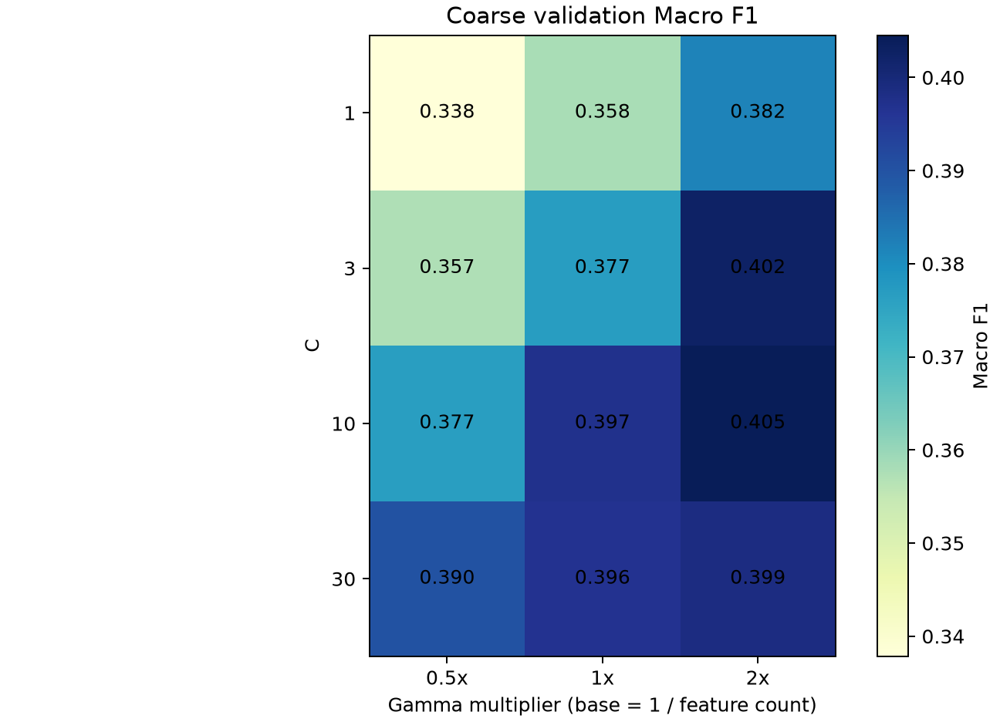

### 结果

- Accuracy：46.84%
- Macro-F1：45.89%
- Weighted-F1：46.93%
- 最终拟合时间：672.65 s
- 单样本分类：5.31 ms
- Support vectors：25,638

相对未调参 SVM：

- Accuracy `+0.53`；
- Macro-F1 `+2.42`；
- 速度几乎不变。

Macro-F1 的提升大于 Accuracy，说明调参主要改善了类别间的平衡，而不是只照顾最大类。最明显的是 `disgust`：Recall 保持 41.44%，Precision 从 29.49% 提升到 56.79%，说明更少的其他类别被错误吸入 `disgust`。

## 6.5 Experiment E：调参坐标 + 38 几何特征 RBF-SVM

最终 Pipeline 为：

```text
136-D normalized coordinates
    -> append 38 geometry descriptors
    -> 174-D StandardScaler
    -> class-balanced RBF-SVM
```

保存后的 Pipeline 对实时端仍接收 136 维输入，在内部自动计算 38 维，避免训练和实时手工处理不一致。

### 搜索和最终参数

几何版本使用相同的 12 组搜索：

```text
C = [1, 3, 10, 30]
gamma = [0.5/174, 1/174, 2/174]
```

粗搜索中 `C=3, gamma=2/174` 的 Macro-F1 最高；在 22,967 张完整内部训练数据上复赛时：

| C | gamma | Validation Accuracy | Validation Macro-F1 |
|---:|---:|---:|---:|
| 3 | 0.0114943 | 46.55% | 44.5817% |
| **10** | **0.0114943** | 46.22% | **44.5842%** |
| 30 | 0.0114943 | 45.63% | 44.2402% |

`C=10` 与 `C=3` 的 Macro-F1 只差约 `0.0024` 个百分点，说明这个选择非常接近，不应声称 `C=10` 在统计意义上明显优于 `C=3`。

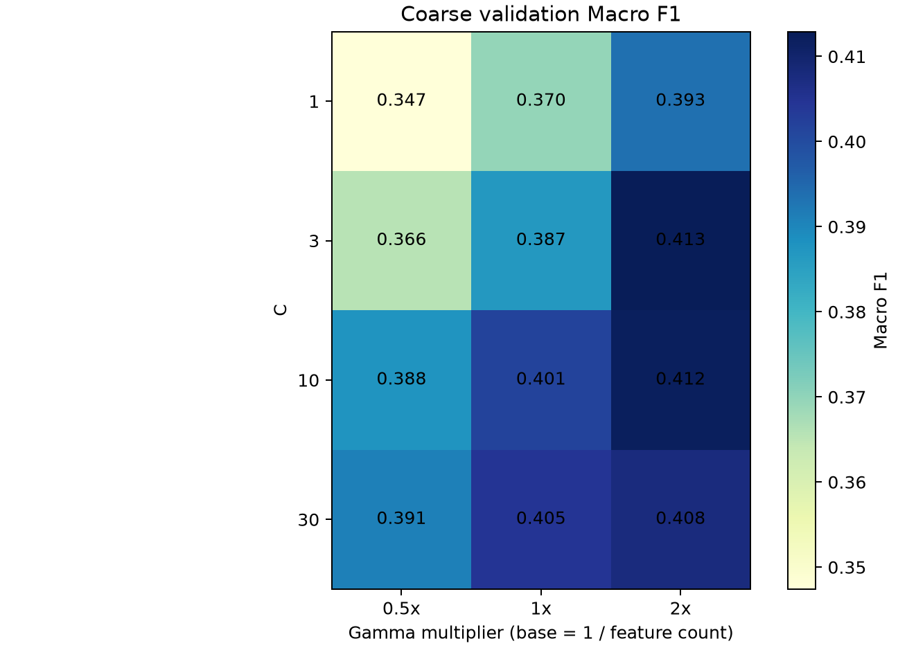

最终参数：

| 参数 | 数值 |
|---|---:|
| C | 10 |
| Gamma | 0.01149425287 = 2/174 |
| Class weight | balanced |
| Decision shape | one-vs-rest |
| Final cache | 2,048 MB |
| Support vectors | 25,743 |

### 结果

- Accuracy：47.31%
- Macro-F1：46.33%
- Weighted-F1：47.35%
- 最终拟合时间：1,535.67 s
- 单样本分类：18.08 ms

相对调参坐标 SVM：

- Accuracy `+0.47`；
- Macro-F1 `+0.44`；
- 分类时间增加 12.77 ms，但仍满足 30 ms。

几何特征不是全面胜出：

- 改善：fear `+2.18` F1，sad `+1.88`，surprise `+0.54`，neutral `+0.04`；
- 下降：happy `-1.03`，disgust `-0.25`，angry `-0.23`。

---

## 6.6 Experiment F：五组显式几何特征消融

### 目的与分组

完整几何模型虽然比纯坐标模型更好，但 38 个量不一定都提供稳定信息。消融把它们按语义分为：

| 组 | 数量 | 含义 |
|---|---:|---|
| `brow` | 8 | 眉间距、眉眼距离、眉斜率及不对称 |
| `eyes` | 10 | 左右眼宽高、EAR、平均/不对称 EAR、面积比例 |
| `nose` | 3 | 鼻宽、鼻到上唇和嘴中心距离 |
| `mouth` | 13 | 嘴宽高、开口比、嘴角、微笑曲率和唇厚 |
| `global` | 4 | 嘴到下巴、嘴中心、眼嘴距离和脸颊不对称 |

其中 `add_x` 表示 `136-D 坐标 + 组 x`；`drop_x` 表示保留其他四组，只删除组 x；`coordinates_only` 和 `all_geometry` 分别是两个锚点。

### 公平协议与固定参数

```text
official train 28,709
    -> fixed stratified split, seed=42
       -> internal fit 22,967
       -> validation 5,742

coarse stage:
    fixed stratified 10,000 samples
    -> 12 variants
    -> select top 3 by validation Macro-F1

full-validation stage:
    22,967 samples
    -> 3 finalists
    -> select one by validation Macro-F1

final stage:
    refit selected variant on all 28,709
    -> evaluate once on official test 7,178
```

所有组合固定使用 class-balanced RBF-SVM、`C=10` 和 `gamma=2/当前特征维数`。因此 gamma 的倍率不变，维数变化时只做尺度补偿。粗筛候选可由 2 个 CPU worker 并行，单个 RBF-SVM 本身并不使用 GPU。

### 10,000 样本粗筛：12 个组合

| 排名 | 组合 | 保留几何组 | 总维数 | Val Accuracy | Val Macro-F1 |
|---:|---|---|---:|---:|---:|
| 1 | `drop_global` | brow + eyes + nose + mouth | 170 | 43.49% | **41.220%** |
| 2 | `all_geometry` | 全部五组 | 174 | 43.40% | 41.205% |
| 3 | `drop_eyes` | brow + nose + mouth + global | 164 | 43.35% | 41.117% |
| 4 | `add_global` | global | 140 | 42.77% | 41.028% |
| 5 | `drop_nose` | brow + eyes + mouth + global | 171 | 43.23% | 41.012% |
| 6 | `add_brow` | brow | 144 | 42.74% | 40.997% |
| 7 | `add_eyes` | eyes | 146 | 42.46% | 40.747% |
| 8 | `drop_mouth` | brow + eyes + nose + global | 161 | 42.79% | 40.722% |
| 9 | `drop_brow` | eyes + nose + mouth + global | 166 | 43.00% | 40.620% |
| 10 | `add_mouth` | mouth | 149 | 42.84% | 40.602% |
| 11 | `add_nose` | nose | 139 | 42.37% | 40.463% |
| 12 | `coordinates_only` | 无 | 136 | 42.20% | 40.455% |

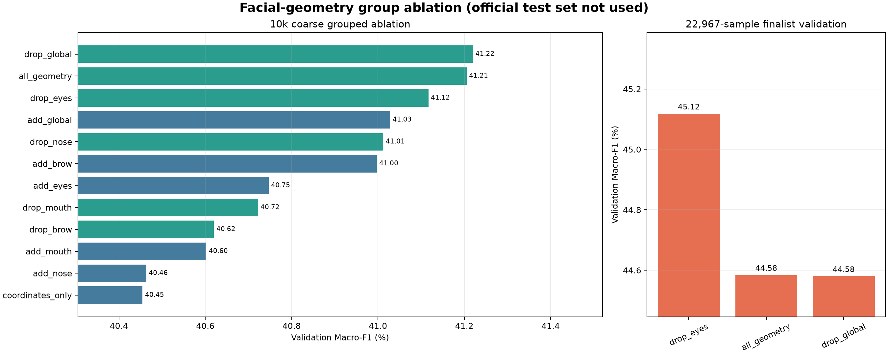

相对 `coordinates_only`，五个单组都没有降低粗筛 Macro-F1，但单组贡献差异很大：

- `global`：`+0.573` 个百分点；
- `brow`：`+0.543`；
- `eyes`：`+0.292`；
- `mouth`：`+0.148`；
- `nose`：`+0.009`，几乎持平。

这不能解释为“global 一定最重要”。单独加入的边际收益与从完整集合删除后的损失是两个不同问题；不同组也会在 RBF 距离空间中互相冗余或互相干扰。

### 22,967 样本全量验证：前三名复赛

| 组合 | 总维数 | Val Accuracy | Val Macro-F1 | Fit time |
|---|---:|---:|---:|---:|
| **`drop_eyes`** | **164** | **46.64%** | **45.118%** | **157.45 s** |
| `all_geometry` | 174 | 46.22% | 44.584% | 244.55 s |
| `drop_global` | 170 | 46.36% | 44.580% | 232.68 s |

粗筛第一名 `drop_global` 在全量验证中没有保持领先；粗筛第三名 `drop_eyes` 反而比完整组高 `0.534` 个 Macro-F1 百分点。这说明 10,000 样本粗筛只能降低计算量，不能作为最终结论，也说明这些小差异对抽样较敏感。

### 选中组合的官方测试结果

内部验证选择 `drop_eyes`，即保留 brow、nose、mouth、global 共 28 个几何量：

```text
136 coordinates + 28 selected geometry = 164 features
C = 10
gamma = 2/164 = 0.01219512195
support vectors = 25,731
```

| 官方测试指标 | 完整 174-D Geometry-SVM | 164-D `drop_eyes` | 差值 |
|---|---:|---:|---:|
| Accuracy | 47.31% | **47.37%** | +0.06 pp |
| Macro-F1 | **46.33%** | 46.25% | -0.09 pp |
| Weighted-F1 | 47.35% | **47.38%** | +0.03 pp |
| Final fit | 1,535.67 s | **967.54 s** | -568.13 s |
| Single prediction | 18.08 ms | **4.90 ms** | -13.18 ms |

两次速度来自不同运行时刻，系统负载会影响绝对值；可以可靠声称两者都低于 30 ms，但不应仅凭这一次计时声称删除眼组必然带来 3.7 倍实时加速。

逐样本比较进一步显示：

- 两者预测类别不同的图片：582；
- 完整模型对、`drop_eyes` 错：148；
- 完整模型错、`drop_eyes` 对：152；
- 净变化：只多判对 4 张，即 `4/7178 = 0.056%` Accuracy。

| Class | 完整模型 F1 | `drop_eyes` F1 | 差值 |
|---|---:|---:|---:|
| angry | 34.41 | 34.24 | -0.16 |
| disgust | 47.67 | 47.18 | -0.49 |
| fear | **34.49** | 33.77 | -0.72 |
| happy | 64.16 | **65.07** | +0.91 |
| neutral | 45.20 | 45.03 | -0.17 |
| sad | **35.95** | 35.35 | -0.60 |
| surprise | 62.47 | **63.09** | +0.62 |

去掉眼组主要改善 happy 和 surprise，却损害 fear、sad、disgust 等类别；这正是 Accuracy 略升而 Macro-F1 略降的原因。眼部组不是“无用特征”：它在部分大类上可能冗余或受 LBF 眼睑误差影响，但仍给多个困难类别提供有效信息。

### 消融结论与不能过度声称的内容

1. 完整五组不是唯一合理组合；`drop_eyes` 在固定内部验证上更好、训练也更快。
2. 该领先没有在官方测试 Macro-F1 上复现，测试差异小于 0.1 个百分点。
3. 当前只让粗筛前三名进入全量复赛，所以不能声称已对全部 `2^5=32` 个子集做穷举。
4. 当前只有一次 80/20 划分，没有重复划分或 5-fold；不能据此断言眼部组普遍有害。
5. 课程任务关注类别不平衡，选择指标是 Macro-F1，因此仍保留完整 174-D 模型作为默认最终模型；164-D 模型作为速度/特征选择候选和消融证据单独保存。

对应产物位于 `artifacts_svm_geometry_ablation/`，不会覆盖 `artifacts_svm_geometry/`。

---

## 7. 总结果对比

| 实验 | 特征 | Accuracy | Macro-F1 | Weighted-F1 | Final fit | Single prediction |
|---|---:|---:|---:|---:|---:|---:|
| HGB | 136 | 43.13% | 39.14% | 42.59% | 358.80 s | 23.41 ms |
| 基础 RBF-SVM | 136 | 46.31% | 43.47% | 46.37% | 370.40 s | 5.17 ms |
| PCA95 + SVM | 12 PCs | 40.32% | 36.13% | 40.38% | **138.32 s** | **2.68 ms** |
| 调参坐标 SVM | 136 | 46.84% | 45.89% | 46.93% | 672.65 s | 5.31 ms |
| **调参几何 SVM** | **174** | **47.31%** | **46.33%** | **47.35%** | 1,535.67 s | 18.08 ms |
| 分组消融 `drop_eyes` | 164 | **47.37%** | 46.25% | **47.38%** | 967.54 s | **4.90 ms** |

注意：

- 训练时间是最后一次完整拟合时间，不包含前面的 12+3 组调参搜索总时间；
- 各次实验在同一环境运行，但系统负载会影响绝对时间；
- `drop_eyes` 的 Accuracy 最高，完整几何模型的 Macro-F1 最高；二者不存在全面支配关系；
- 由于参数/特征选择以 Macro-F1 为目标，默认模型仍是完整几何模型；
- PCA 是速度最好但精度损失最大的方案。

五个模型的分类正确数：

| 模型 | Correct / 7,178 |
|---|---:|
| HGB | 3,096 |
| 基础 SVM | 3,324 |
| PCA-SVM | 2,894 |
| 调参 SVM | 3,362 |
| 几何 SVM | 3,396 |
| 消融 `drop_eyes` | 3,400 |

其中：

- 1,809 张图五个模型全部正确；
- 2,456 张图五个模型全部错误；
- 几何模型纠正了调参坐标 SVM 的 458 张错误；
- 几何模型也让调参坐标 SVM 原本正确的 424 张变错；
- 两者相抵净增加 34 张正确图片，正好对应约 `34/7178 = 0.47%` Accuracy；
- 有 824 张图两个完整特征 SVM 都正确但 PCA 错误；反过来 PCA 正确而两个完整模型都错的有 450 张。

这些逐图结果比单一 Accuracy 更能说明“改进不是对所有样本同时发生”。

上面的五模型图片画廊是在消融实验之前固定生成的，因此仍用于解释 HGB、PCA、坐标和完整几何模型；`drop_eyes` 与完整模型的逐样本净变化在 6.6 节单独报告，避免悄悄改变既有案例集合。

---

## 8. 各类别表现

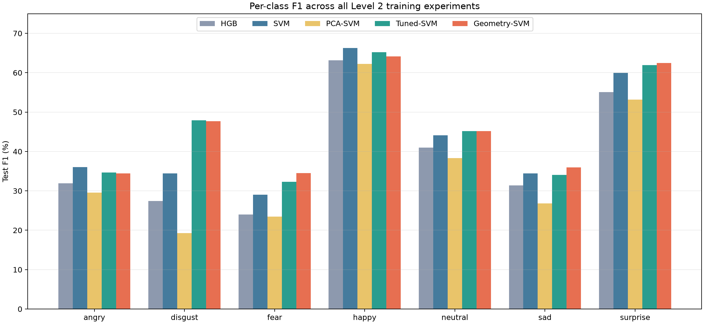

| Class | HGB F1 | SVM F1 | PCA F1 | Tuned F1 | Geometry F1 |
|---|---:|---:|---:|---:|---:|
| angry | 31.92 | **36.04** | 29.59 | 34.64 | 34.41 |
| disgust | 27.42 | 34.46 | 19.25 | **47.92** | 47.67 |
| fear | 24.00 | 28.99 | 23.49 | 32.31 | **34.49** |
| happy | 63.14 | **66.30** | 62.22 | 65.19 | 64.16 |
| neutral | 41.02 | 44.11 | 38.34 | 45.16 | **45.20** |
| sad | 31.40 | 34.46 | 26.82 | 34.07 | **35.95** |
| surprise | 55.10 | 59.94 | 53.20 | 61.93 | **62.47** |

观察：

- `happy` 和 `surprise` 始终最好，因为大笑、张嘴、眼睛睁大等变化会直接改变关键点几何；
- `fear`、`sad`、`angry` 仍然困难，三者都可能出现眉头变化、嘴角下压或嘴部张开；
- `disgust` 的最终 F1 很高于 HGB/PCA，但样本只有 111 张，统计波动更大；
- Geometry-SVM 最明显改善 `fear` 和 `sad`，符合眉眼距离、嘴角和嘴到下巴特征的设计目标；
- `happy` 反而下降，说明新增比率也可能把夸张张嘴、头部姿态或 LBF 误差放大。

---

## 9. 最终混淆矩阵

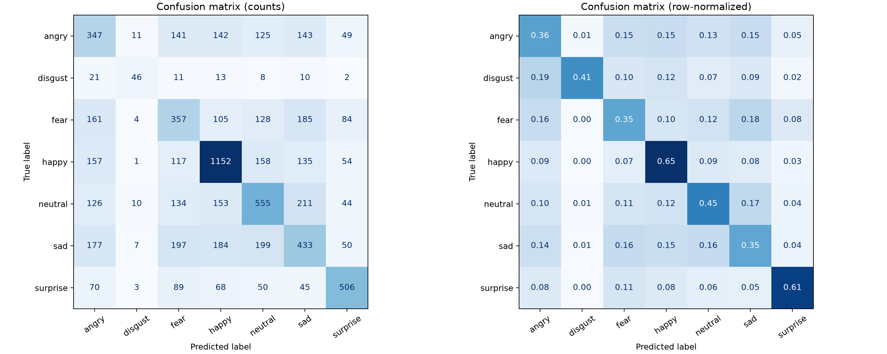

| True class | Recall | 最大的三个错误去向 |
|---|---:|---|
| angry | 36.22% | sad 143；happy 142；fear 141 |
| disgust | 41.44% | angry 21；happy 13；fear 11 |
| fear | 34.86% | sad 185；angry 161；neutral 128 |
| happy | 64.94% | neutral 158；angry 157；sad 135 |
| neutral | 45.01% | sad 211；happy 153；fear 134 |
| sad | 34.72% | neutral 199；fear 197；happy 184 |
| surprise | 60.89% | fear 89；angry 70；happy 68 |

最明显的混淆簇是：

```text
fear <-> sad <-> angry/neutral
```

原因不是单一模型缺陷，而是 keypoint-only 信息边界：

- fear 与 surprise 都可能张嘴、睁眼和抬眉；
- sad 与 neutral 的关键点差异可能只是一点嘴角和内眉变化；
- angry 与 disgust 常需要鼻纹、眉间皱纹和脸颊张力；
- 这些纹理不会进入 68 点坐标。

---

## 10. 如何阅读下面的真实图片对照

每个案例左侧是 FER 原始 `48×48` 图片，右侧是训练真正使用的归一化 68 点形状。

预测列表：

```text
HGB
SVM          # 基础坐标 SVM
PCA-SVM
Tuned-SVM    # 调参坐标 SVM
Geometry-SVM # 最终模型
```

`OK` 表示预测与数据集标签一致；`ERR` 表示不一致。

正确不等于图片标签绝对正确。FER 存在人工标签歧义，所以本文同时讨论“模型错了”和“标签/图片本身可能有问题”。

---

## 11. 为什么有些图片所有模型都能判对

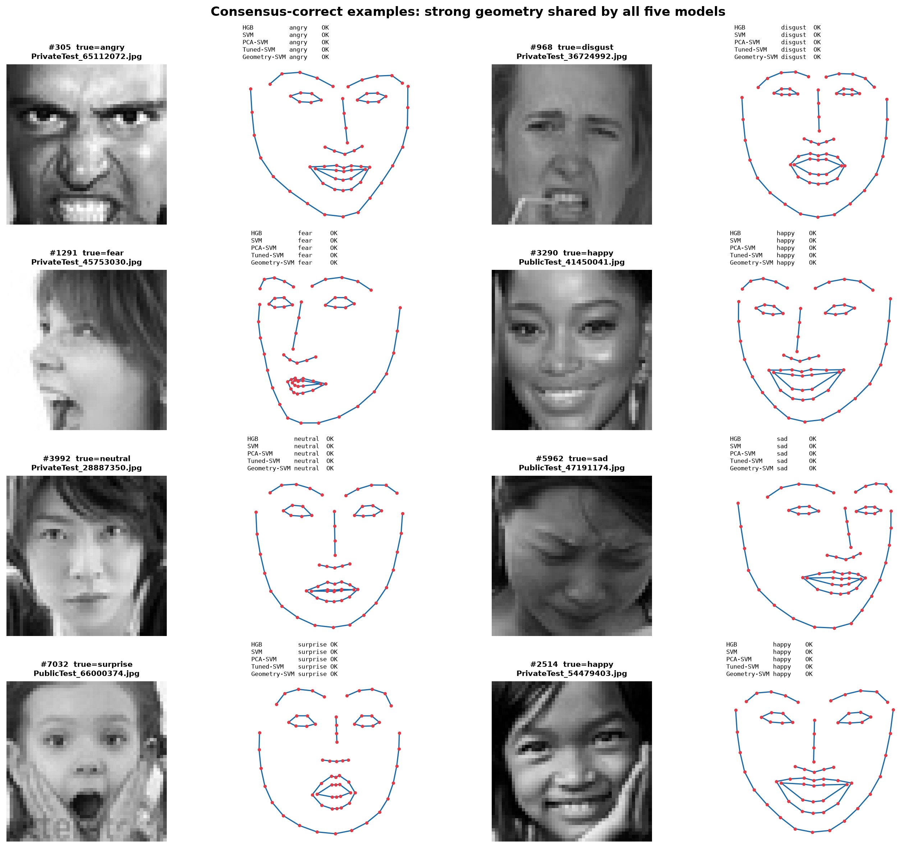

### 代表案例

**#305 angry**

- 眉毛明显向内并压低；
- 眼部紧张；
- 嘴部张开、牙齿暴露，但嘴角不是稳定上扬的笑形；
- 原图和 68 点都包含较强信号，因此树和四种 SVM 全部正确。

**#3290 与 #2514 happy**

- 嘴宽明显增大，嘴角上扬；
- 外嘴和内嘴轮廓形成稳定笑形；
- 眼睛略眯，和嘴部同时支持 happy；
- 这是 keypoint-only 最擅长的情况。

**#7032 surprise**

- 眼睛开度大；
- 内外嘴均明显张开；
- 眉毛位置较高；
- surprise 的组合几何远离 neutral/sad，因此五个模型一致。

**#3992 neutral**

- 嘴闭合，曲率小；
- 眼睛和眉毛没有夸张形变；
- 归一化形状接近中性区域。

结论：当表达类别的线索能稳定映射为眉、眼、嘴关键点变化，并且 LBF 拟合正确时，模型类型差异并不重要。

---

## 12. 显式几何特征怎样纠正坐标 SVM

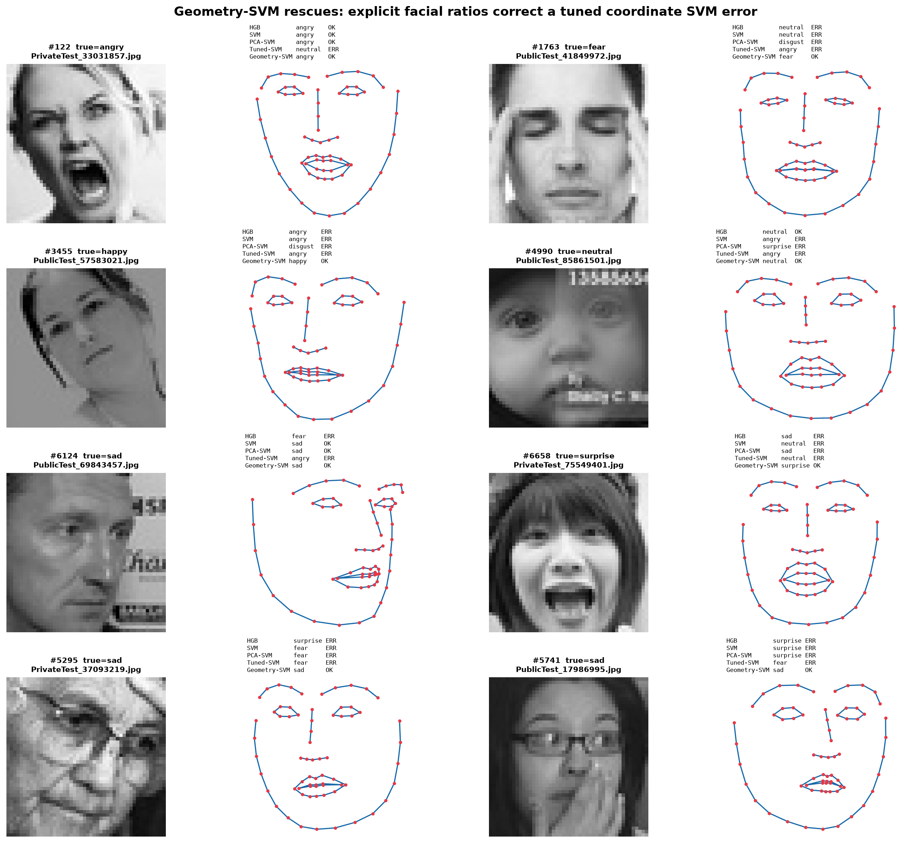

测试集中有 458 张图属于“调参坐标 SVM 错、Geometry-SVM 对”。

### #6658 surprise：明确的几何纠错

- 原图有大幅张嘴和较高眉眼开度；
- Tuned-SVM 判断 neutral；
- Geometry-SVM 判断 surprise；
- `inner_mouth_aspect_ratio`、眼睛 EAR、眉眼距离把这些关系直接提供给 SVM，比让 SVM 从十多个坐标自己组合更容易。

### #3455 happy：轻微嘴角关系被显式表达

- 原图笑容不算夸张，低清和姿态使绝对坐标模式不典型；
- HGB、基础/调参 SVM 都判断 angry；
- 几何版本利用嘴角抬升、微笑曲率和嘴宽高关系得到 happy。

这里应使用“可能由这些特征帮助”而非“已经证明某一个特征导致预测”，因为当前没有做单样本 SHAP/ablation。

### #1763 fear：多处弱线索的组合

- 眼眉和嘴部变化都不极端，容易落入 neutral/angry/disgust；
- 四个对照模型给出三个不同错误类别；
- Geometry-SVM 得到 fear；
- 眉眼距离、眼开合、嘴角/嘴到下巴等组合可能使该样本更接近 fear。

### #5295 sad：纠正结果也可能是偶然

- 原图被报纸遮挡且只有部分脸；
- 68 点轮廓明显受姿态和遮挡影响；
- Geometry-SVM 恰好预测正确，不能据此声称特征在遮挡下可靠；
- 这是“标签一致”但证据质量较差的成功案例。

结论：几何特征减少了 SVM 学习比例关系的难度，但并没有提高 LBF 本身的可靠性。

---

## 13. PCA 为什么会把明显案例判错

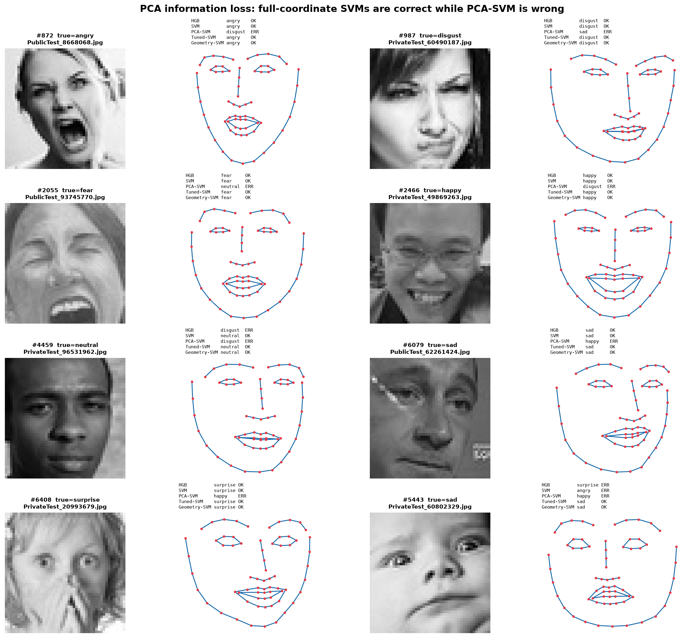

图中样本均满足：Tuned-SVM 和 Geometry-SVM 正确，而 PCA-SVM 错误。

### #987 disgust

- 眉眼压低、嘴部紧张，原图还有鼻部/面颊纹理；
- PCA-SVM 判断 sad；
- 压缩后的 12 个主成分保留整体脸形，却可能丢掉眉眼斜率、嘴角不对称等低方差关系；
- 同时纹理本来就没有进入任何模型，因此 PCA 后可用信息更少。

### #2466 happy

- 清晰的大笑嘴形；
- 完整坐标模型均为 happy，PCA-SVM 为 disgust；
- 说明 95% 方差不是 95% 分类信息；PCA 的投影可能把对 happy 很重要的嘴形方向与其他总体变化混合。

### #6408 surprise

- 眼睛明显睁大，但嘴部被手遮挡；
- 完整模型仍能利用剩余的眼眉和脸形细节判断 surprise；
- PCA-SVM 判断 happy；
- 当部分区域缺失时，未被保留的小方向可能更加关键。

### #5443 sad

- 头部旋转且表情细微；
- PCA、HGB 和基础 SVM 均错，两个调参完整模型正确；
- 这说明该案例同时受“降维损失”和“决策边界参数”影响，不能只归因于 PCA。

公平结论：PCA 并非每张图都更差。仍有 450 张图是 PCA 正确、两个完整模型都错误；但总体净结果显著下降，所以不适合作为最终方案。

---

## 14. 为什么增加几何特征也会让一些图片变错

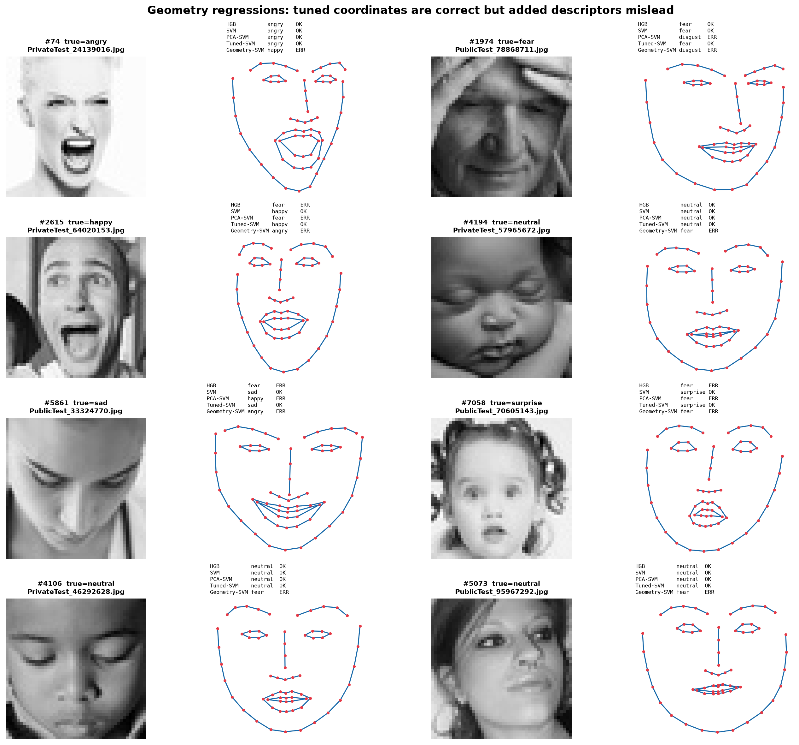

有 424 张图属于“Tuned-SVM 正确、Geometry-SVM 错误”。

### #74 angry -> happy

- 原图大幅张嘴，视觉上也容易被理解为惊讶或开心；
- 嘴宽、嘴高、嘴角曲率等显式量很强；
- 几何模型可能过度依赖嘴部比率，而坐标模型保留了眉眼和整体形状的更细组合；
- 也存在 FER 标签歧义。

### #2615 happy -> angry

- 嘴张开且眼眉形状夸张；
- Geometry-SVM 判断 angry；
- 显式特征把某些局部变化放大后，并不一定能区分“开心大叫”和“愤怒大叫”。

### #4194、#4106、#5073 neutral -> fear

- 这些图包含闭眼/眯眼、侧脸、低对比或轻微姿态；
- LBF 的眼高、EAR、眉眼距离和左右不对称容易受一个点偏移影响；
- 比率特征会用较小距离作分母，噪声可能被放大；
- 三张 neutral 都被最终几何模型吸入 fear，说明当前 38 项中可能有冗余或过敏感描述量。

### #7058 surprise -> fear

- fear 和 surprise 共享抬眉、睁眼、张嘴；
- 区别常依赖面部紧张和纹理，而关键点只有形状；
- 增加更多形状比率不能完全解决两个类别的语义重叠。

结论：特征工程提供的是归纳偏置。设计正确时更容易学习，设计过强或输入点不稳时也会系统性误导。

---

## 15. 五个 landmark-only 模型为什么会一起错

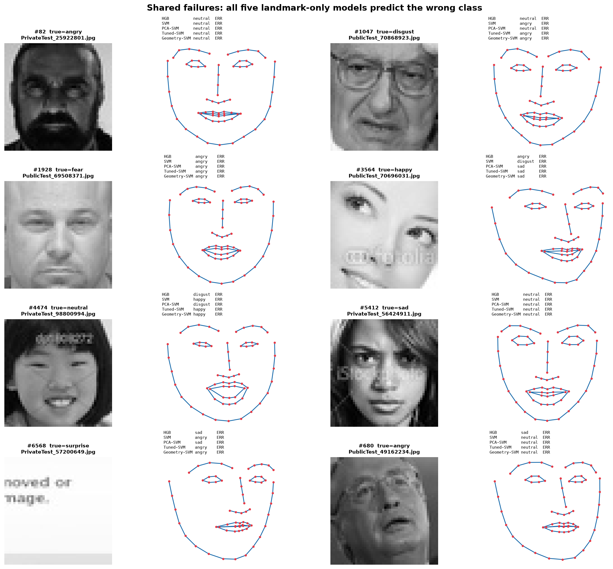

共有 2,456 / 7,178 张测试图五个模型全部错误，约 34.22%。这些案例揭示了模型上限。

### #82：标签与可见表情不一致

- 数据标签为 angry；
- 图片和关键点更像 neutral，嘴和眉眼都没有明显愤怒形变；
- 五个模型全部判断 neutral；
- 可能是标签噪声、表情极弱，或纹理中有关键线索但 68 点看不到。

### #1047：disgust 的纹理信息缺失

- 戴眼镜，嘴形变化较弱；
- disgust 常依赖鼻部皱纹、上唇抬升、脸颊张力；
- 68 点对鼻梁和鼻翼只有少量轮廓点，无法表示皱纹；
- 模型集中判断 angry/neutral。

### #1928：fear 与 angry 的几何重叠

- 眼睛接近闭合，嘴部没有典型 surprise 式张开；
- 数据标签是 fear，但几何更接近 angry/sad；
- 五个模型全部 angry。

### #4474：neutral 图中存在明显笑容

- 数据标签为 neutral；
- 原图和嘴部关键点都有可见的上扬与开口；
- SVM 系列多判断 happy；
- 这是典型标签歧义，不能简单归咎于模型。

### #6568：图片甚至不是有效人脸

- 原图主要是文字，数据标签为 surprise；
- 因为离线流程强制把中心区域交给 LBF，LBF 仍返回了一组看似正常的人脸点；
- 五个模型都只能对“虚构关键点”分类；
- 这证明 100% landmark extraction success 不能等价为 100% valid landmarks。

### #3564：极端裁剪和水印

- 只有局部眼睛和脸部区域，并带明显文字；
- 下半脸信息缺失；
- LBF 仍补出完整 68 点，点形未必对应真实结构；
- 模型预测不可依赖。

### #5412、#680：低清、低对比、弱表情

- sad/angry 标签的可见几何都很弱；
- 人工观看也接近 neutral；
- 纹理和上下文不足时，keypoint-only 很难恢复标签。

---

## 16. 高置信度错误应该怎样解释

最终程序还会选择决策分数第一名与第二名差距最大的错误样本：

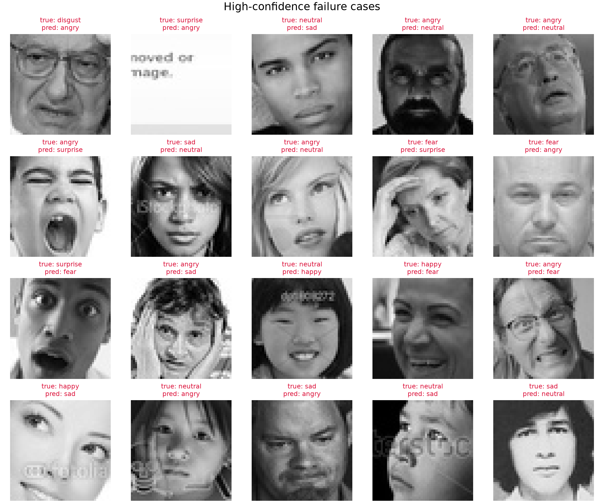

这里的“高置信度”实际是较大的 decision margin，不是经过校准的概率。模型很自信仍然可能错误，常见原因：

- 图片标签本身可疑；
- 训练集中存在相似的错误模式；
- LBF 在遮挡或异常裁剪下稳定地产生了错误关键点；
- 模型只能看到点形，无法知道图片含文字、眼镜、阴影或不是有效人脸。

因此答辩中应说“high-margin failure”，不要说“模型有 99% 概率但错了”，除非另做概率校准。

---

## 17. 结果为什么只有约 47%，它算不算失败

不能只把 47.31% 与普通清晰图像 CNN 比较。

1. 这是 7 分类，随机均匀基线约 14.29%；
2. 输入被严格限制为 LBF 68 点，不包含灰度纹理；
3. FER 图片只有 48×48，标签噪声和裁剪问题明显；
4. fear/sad/angry/neutral 的二维点形高度重叠；
5. 训练的价值还包括受控对比、参数选择、错误分析和实时限制，而不只是追求最高 Accuracy。

合理表述：

> 在纯关键点限制下，RBF-SVM 明显优于 HGB 和 PCA-SVM；调参和显式几何进一步把 Accuracy 提升到 47.31%、Macro-F1 提升到 46.33%，且单次分类为 18.08 ms。失败样本说明剩余误差主要来自纹理缺失、标签歧义、低分辨率和 LBF 拟合错误。

---

## 18. 当前方法的局限性

### 数据局限

- FER-2013 标签存在主观性和错误；
- `disgust` 样本非常少；
- 48×48 使眉、眼、嘴细节模糊；
- 存在文字、水印、非人脸、异常裁剪和遮挡。

### LBF 局限

- 强制中心区域提高覆盖率，却会在坏图上“幻觉”出 68 点；
- 没有保存每张图的 landmark quality score；
- 眼点错误会污染整个归一化；
- 二维对齐不能消除三维头部姿态。

### 特征局限

- 坐标仍包含个体脸形差异；
- 38 个特征由人工设计，可能冗余；
- 比率和不对称量可能放大单点噪声；
- 完全没有纹理、皱纹、脸颊张力和阴影；
- 单帧图片没有表情变化过程。

### 模型和验证局限

- 只做一次固定 80/20 验证，没有 5-fold 方差；
- 未对 C/gamma 做更细的局部搜索；
- 约 87%–90% 训练样本成为 SVM support vectors，说明类别重叠和边界复杂；
- decision score 未校准为真实概率；
- 30 ms 只测分类器，不代表端到端摄像头延迟。

### 解释局限

- 图片分析是视觉解释，不是正式 feature attribution；
- “Geometry-SVM 判对”不代表一定由某个指定几何量导致；
- 与数据标签一致不一定与人类语义一致。

---

## 19. 下一步最有价值的改进

本轮已经完成五组 add-one / drop-one 消融。它发现 `drop_eyes` 在固定验证集领先，但官方测试 Macro-F1 略降，因此没有把验证集结果误当成稳定提升。下一步应优先验证这种差异是否能跨划分复现。

按仍保持 keypoint-only 的优先级排序：

1. **Landmark quality control**
   用脸框覆盖、点分布、眼距、轮廓范围和拟合稳定性过滤非人脸与异常点。

2. **重复分层验证或 5-fold 复核消融**
   报告完整几何与 `drop_eyes` 的均值、标准差和胜出次数，判断约 0.5 个验证 Macro-F1 百分点的差异是否稳定。

3. **特征选择**
   在训练集内部对 38 个单项使用 permutation importance、mutual information 或稳定性选择，避免把整个眼组一次性删除。

4. **更细的 C/gamma 局部搜索**
   特征子集改变后最佳 gamma 未必仍是 `2/d`；可对完整组和稳定子集分别在 `C=[3,5,7,10]`、gamma 倍率 `[1,1.5,2,3]` 内验证。

5. **补充交互组合**
   当前只做基线、五个 add-one、完整组和五个 drop-one，没有覆盖全部 32 个组子集。可先验证 `brow+global`、`brow+mouth+global` 等粗筛提示较强的组合。

6. **同关键点输入的 MLP / Random Forest / calibrated SVM 对照**
   保持输入一致，避免把模型改进和图像纹理混在一起。

7. **实时端使用时间信息**
   对连续视频的类别分数做 EMA、投票或短时序模型；当前 `task2_realtime.py` 已使用概率 EMA 减少闪烁，但训练仍是单帧。

如果规则允许增加图片外观特征，可以另做 landmark + texture/CNN 实验；但这已经不再是严格 keypoint-only，必须单独报告。

---

## 20. 复现命令

在 `visual-computing` Conda 环境中：

```powershell
Set-Location "<repo-root>\expert_level"
```

重新提取全部关键点并训练默认 HGB：

```powershell
python task1_pipeline.py
```

使用已有缓存训练基础 SVM：

```powershell
python task1_pipeline.py --stage train --classifier svm `
  --features artifacts\fer_landmark_features.npz `
  --output artifacts_svm
```

训练 PCA95-SVM：

```powershell
python task1_pipeline.py --stage train --classifier svm --pca-variance 0.95 `
  --features artifacts\fer_landmark_features.npz `
  --output artifacts_svm_pca95
```

调参坐标 SVM：

```powershell
python tune_svm.py
```

调参几何 SVM：

```powershell
python tune_svm.py --geometry --output artifacts_svm_geometry
```

运行五组几何特征消融（支持从已有 CSV 结果继续）：

```powershell
python ablate_geometry_groups.py
```

只检查分组、组合数量和缓存尺寸，不训练：

```powershell
python ablate_geometry_groups.py --check
```

运行最终实时模型：

```powershell
python task2_realtime.py
```

临时对比消融候选而不改变默认模型：

```powershell
python task2_realtime.py --expression-model `
  artifacts_svm_geometry_ablation\expression_classifier.joblib
```

---

## 21. 关键证据文件

| 内容 | 文件 |
|---|---|
| 训练主流程 | `task1_pipeline.py` |
| C/gamma 搜索 | `tune_svm.py` |
| 五组 add-one / drop-one 消融 | `ablate_geometry_groups.py` |
| 归一化与 38 几何特征 | `expression_features.py` |
| 几何分组单元测试 | `test_expression_features.py` |
| 原始特征缓存 | `artifacts/fer_landmark_features.npz` |
| HGB 指标 | `artifacts/metrics.json` |
| 基础 SVM 指标 | `artifacts_svm/metrics.json` |
| PCA-SVM 指标 | `artifacts_svm_pca95/metrics.json` |
| 调参坐标 SVM | `artifacts_svm_tuned/metrics.json` |
| 最终几何 SVM | `artifacts_svm_geometry/metrics.json` |
| 最终分类报告 | `artifacts_svm_geometry/classification_report.txt` |
| 最终混淆矩阵 | `artifacts_svm_geometry/confusion_matrix.png` |
| 最终高 margin 错误 | `artifacts_svm_geometry/failure_cases.png` |
| 几何调参全部候选 | `artifacts_svm_geometry/svm_tuning_results.csv` |
| 消融 12 个粗筛与 3 个全量结果 | `artifacts_svm_geometry_ablation/group_ablation_results.csv` |
| 消融验证结果图 | `artifacts_svm_geometry_ablation/group_ablation_validation.png` |
| 消融候选指标 | `artifacts_svm_geometry_ablation/metrics.json` |
| 消融候选模型 | `artifacts_svm_geometry_ablation/expression_classifier.joblib` |
| 消融候选分类报告 | `artifacts_svm_geometry_ablation/classification_report.txt` |
| 消融候选混淆矩阵 | `artifacts_svm_geometry_ablation/confusion_matrix.png` |
| 五模型逐图预测 | `level2_report_assets/prediction_comparison.csv` |
| 本文案例索引 | `level2_report_assets/comparison_summary.json` |

---

## 22. 答辩时的一分钟讲法

> 我们严格使用 Part 1 的 LBF 68 点，不把原图像素输入分类器。先通过眼中心做平移、旋转和尺度归一化，得到 136 维坐标。基础 HGB 的 Accuracy 是 43.13%，改用 class-balanced RBF-SVM 后达到 46.31%。PCA 把 136 维压到 12 维，速度提高但 Accuracy 降到 40.32%，因为总方差不等于分类信息。之后只在训练集内部搜索 C 和 gamma，坐标 SVM 达到 46.84%；加入 38 个关键点几何量后达到 47.31% Accuracy 和 46.33% Macro-F1。我们又把几何量分成眉、眼、鼻、嘴、全局五组，做 12 个粗筛和 3 个全量复赛。验证集选择了去眼组的 164 维模型，但它在官方测试上只是多判对 4 张，Accuracy 47.37%，Macro-F1 反而降到 46.25%。因此我们把消融视为“眼部组存在冗余或噪声的线索”，而不是证明眼部特征无用，并继续保留 Macro-F1 更高的完整模型。共同错误主要来自 FER 标签歧义、48×48 低清、遮挡、非人脸坏图，以及关键点看不到的纹理信息。
