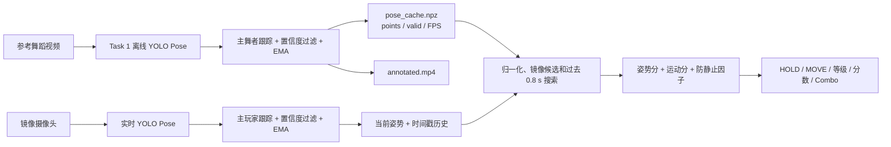
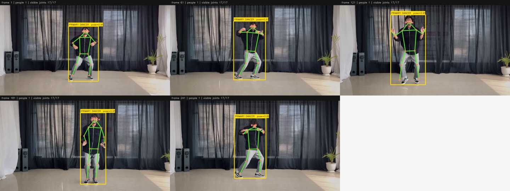

# Level 3 / Bonus Task 2 舞蹈评分系统详细实现报告

> 对应目录：`project/part three`  
> 主程序：`just_dance_app.py`（`danceapp.py` 是兼容课程 starter 的入口）  
> 核心评分：`dance_scoring.py`  
> 姿态提取：预训练 `yolov8n-pose.pt`，17 个 COCO 关键点  
> 默认设置：0.8 s 反应延迟、0.4 s 运动窗口、允许镜像  
> 结论和测试核对日期：2026-07-23

---

## 1. 系统完成了什么

Level 3 实现了一个类似 Just Dance 的实时舞蹈模仿评分系统：

1. 左侧播放已经分析好的参考舞蹈；
2. 右侧读取镜像摄像头并检测玩家的 17 个身体关键点；
3. 忽略人与参考视频之间的画面位置和身体大小差异；
4. 同时比较单帧姿势和最近一小段时间内的运动；
5. 容忍玩家相对参考动作最多 0.8 秒的自然反应延迟；
6. 可选择接受左右镜像动作；
7. 对站立不动、参考动作停顿、关键点缺失分别给出不同处理；
8. 输出 `PERFECT / GREAT / GOOD / MISS / MOVE! / HOLD / SYNC`、总分、平均相似度和 Combo。

最重要的技术口径是：

> **系统没有为舞蹈评分重新训练神经网络。** 人体姿态由预训练 YOLOv8n Pose 提取；本项目实现的是主舞者跟踪、关键点过滤和平滑、姿态归一化、几何相似度、运动相似度、延迟对齐和游戏计分规则。

系统比较的是人体骨架，而不是 RGB 外观，因此：

- 玩家和参考人物不需要穿相同衣服；
- 背景不同不会直接进入评分公式；
- 人在画面中的平移和统一缩放基本不会影响分数；
- 表情、手指、身体纹理和三维深度不会被评分。

---

## 2. 整体数据流



该设计把计算分成离线和在线两部分：

| 部分 | 执行时间 | 主要工作 |
|---|---|---|
| 参考视频 | 游戏前一次性处理 | 对参考舞者运行 YOLO，保存 17 点缓存 |
| 摄像头玩家 | 游戏运行时 | 每个新摄像头结果运行一次 YOLO |
| 评分 | 游戏运行时 | 只处理关键点数组，不重新分析参考画面 |

这样避免在游戏运行时同时对参考视频和摄像头运行两路 YOLO，对 CPU 环境非常重要。

---

## 3. 参考视频和姿态缓存

默认参考缓存通过下面的方式生成：

```powershell
python pose_analyzer.py dance_example_1.mp4 `
  --start-frame 300 --max-frames 300 --stride 3 `
  --image-size 416 --contact-every 60 --output task2_results
```

源视频参数与实测结果：

| 项目 | 数值 |
|---|---:|
| 原视频尺寸 | 1280 × 720 |
| 原视频 FPS | 30 |
| 起始源帧 | 300 |
| Stride | 3 |
| 缓存播放 FPS | 10 |
| 缓存帧数 | 300 |
| 游戏片段长度 | 30 s |
| 检测到主舞者的帧 | 300 / 300 |
| 多人画面 | 9 / 300 |
| 平均可见关键点 | 16.963 / 17 |
| 平均可见点置信度 | 0.9359 |
| CPU 平均 YOLO 推理 | 131.57 ms |
| 完整离线处理速度 | 5.82 FPS |



保存的 `pose_cache.npz` 包括：

- `points`：`N × 17 × 2` 的关键点坐标；
- `valid`：`N × 17` 的关键点可用掩码；
- `boxes`：每帧主舞者框；
- `source_frames`：缓存帧对应的源视频帧；
- `source_fps`：源视频 FPS；
- `playback_fps`：缓存和标注视频的播放 FPS。

参考 MP4 和关键点缓存使用相同帧数与播放 FPS，因此左侧画面与评分用参考点保持对应。

---

## 4. YOLO 关键点和实际参与评分的关节

YOLOv8 Pose 输出 17 个 COCO 关键点：

| Index | 关键点 | Index | 关键点 |
|---:|---|---:|---|
| 0 | nose | 9 | left wrist |
| 1 | left eye | 10 | right wrist |
| 2 | right eye | 11 | left hip |
| 3 | left ear | 12 | right hip |
| 4 | right ear | 13 | left knee |
| 5 | left shoulder | 14 | right knee |
| 6 | right shoulder | 15 | left ankle |
| 7 | left elbow | 16 | right ankle |
| 8 | right elbow |  |  |

评分只使用 `5:17`，即肩膀到脚踝的 12 个身体关节。

不使用脸部 0–4 点的原因：

- 舞蹈动作主要由躯干和四肢表达；
- 人脸点在全身画面中很小；
- 低分辨率下眼、耳、鼻点更容易抖动；
- 加入脸点可能让头部检测噪声影响全身评分。

如果玩家与参考之间共同可用的身体关节少于 4 个，该候选姿势不能评分。

---

## 5. 主舞者选择和身份连续性

画面可能出现多个人。系统不会简单选择置信度最高的人，而是综合人物大小、中心位置、检测置信度和上一帧连续性。

### 5.1 第一帧

对检测人物 \(k\)：

\[
T_k = 0.60A_k + 0.30C_k + 0.10D_k
\]

其中：

- \(A_k\)：人物框面积相对画面的归一化得分；
- \(C_k\)：人物框中心接近画面中心的得分；
- \(D_k\)：YOLO 人物框置信度。

面积得分在人物框达到画面面积的 35% 时封顶为 1。

### 5.2 后续帧

\[
T_k = 0.30A_k + 0.15C_k + 0.45Q_k + 0.10D_k
\]

连续性 \(Q_k\) 取下面两项的较大值：

\[
Q_k =
\max\left(
\operatorname{IoU}(B_k,B_{t-1}),
\exp(-12d_k)
\right)
\]

其中 \(d_k\) 是当前人物框中心与上一帧中心的距离除以画面对角线。

这样做的作用：

- 第一帧倾向选择画面中又大又居中的主要人物；
- 后续帧把 45% 权重交给身份连续性；
- 背景人物短暂变大或检测置信度变高时，不容易抢走主舞者身份；
- 连续 8 帧以上没有检测到人时，跟踪器重置，避免长期保留过期身份。

---

## 6. 关键点置信度过滤与 EMA 平滑

### 6.1 可见点过滤

关键点置信度阈值默认为：

\[
c_i \ge 0.35
\]

低于阈值的点被标记为不可用，不参与中心、尺度、距离、角度或运动计算。

这比把低置信度坐标继续连入骨架更安全，尤其适用于：

- 手腕被身体遮挡；
- 腿部超出画面；
- 快速动作造成运动模糊；
- 多人重叠。

### 6.2 时间平滑

若同一关节在当前帧和上一帧都有效：

\[
\hat{p}_{t,i}
=
0.60p_{t,i}
+
0.40\hat{p}_{t-1,i}
\]

其中：

- \(p_{t,i}\)：当前 YOLO 坐标；
- \(\hat{p}_{t-1,i}\)：上一帧平滑坐标；
- 0.60 是当前帧权重。

只对连续有效的点做平滑，不会用上一帧坐标“伪造”当前已不可见的关节。

权衡：

- 更小的当前帧权重会更稳定，但增加动作拖尾；
- 更大的当前帧权重响应更快，但更容易抖动；
- 当前 0.60 是稳定性和响应速度的折中。

---

## 7. 姿态归一化

摄像头玩家和参考人物的像素坐标不能直接比较。玩家可能站在画面左边、离摄像头更近，参考人物也可能被不同尺寸裁剪。

### 7.1 有效性检查

先删除非有限坐标，并要求 12 个身体关节中至少有 4 个有效。

### 7.2 平移中心

优先使用髋中心：

\[
r = \frac{p_{11}+p_{12}}{2}
\]

上式是左右髋都有效时的情况；代码实际对当前有效的髋点取均值，因此只检测到一个髋点时仍可用该点作为根节点。

若髋部不可用，则使用肩中心：

\[
r = \frac{p_5+p_6}{2}
\]

肩中心同样对当前有效的肩点取均值。若髋和肩中心都无法得到，则使用全部可见身体关节的中心。

髋中心比图像中心稳定，因为它更接近人体运动学根节点；抬手和踢腿时人体中心不会随手脚产生过大偏移。

### 7.3 身体尺度

系统计算多个候选尺度，并取最大值：

\[
s = \max
\left(
w_{shoulder},
w_{hip},
1.35h_{torso},
0.35d_{bodyspan}
\right)
\]

候选项只在相应关键点可见时加入：

- \(w_{shoulder}=\|p_5-p_6\|\)：肩宽；
- \(w_{hip}=\|p_{11}-p_{12}\|\)：髋宽；
- \(h_{torso}\)：肩中心到髋中心距离；
- \(d_{bodyspan}\)：可见身体点横纵范围组成的对角长度。

取最大值比只使用肩宽更鲁棒：

- 侧身时肩宽可能显著变小；
- 手臂遮挡时肩点可能不稳定；
- 有时只有上半身或部分下半身可见；
- 多个候选可以互相兜底。

### 7.4 归一化公式

\[
q_i = \frac{p_i-r}{s}
\]

结果 \(q_i\) 是以人体根节点为中心、以身体尺度为单位的相对坐标。

因此若原始姿态统一平移 \(b\)、缩放 \(a\)：

\[
p'_i = ap_i+b
\]

归一化后仍得到几乎相同的 \(q_i\)。确定性测试已经验证“平移并放大 3.4 倍”仍能得到接近 100 分。

### 7.5 没有消除什么

当前归一化不执行任意二维旋转，也不能消除三维透视：

- 玩家整体侧倾仍是动作的一部分；
- 摄像头俯拍、仰拍会改变骨架；
- 大幅度侧身会使二维关节距离发生压缩；
- 深度方向动作无法由二维点完全恢复。

---

## 8. 单帧姿势分

单帧姿势分由“关节位置”和“关节角度”两部分构成。

### 8.1 共同可见关节和 Coverage

只有玩家与参考都有效的身体关节才进入比较。

\[
\operatorname{coverage}
=
\frac{N_{common}}{12}
\]

手腕和脚踝比肩、髋携带更多舞蹈动作信息，因此权重为：

\[
w_i =
\begin{cases}
1.35,& i \in \{9,10,15,16\}\\
1.00,& \text{其他身体关节}
\end{cases}
\]

### 8.2 归一化位置相似度

每个共同关节的距离：

\[
d_i = \|q^{player}_i-q^{reference}_i\|_2
\]

使用高斯函数转成 0–1 相似度：

\[
S^{pos}_i
=
\exp
\left[
-\frac{1}{2}
\left(
\frac{d_i}{0.55}
\right)^2
\right]
\]

加权位置分：

\[
S_{pos}
=
\frac{\sum_i w_iS^{pos}_i}{\sum_iw_i}
\]

解释：

- 完全重合时 \(d_i=0\)，该点相似度为 1；
- 当归一化距离为 0.55 时，相似度约为 0.6065；
- 误差继续增加时平滑下降，不会因为刚超过硬阈值就突然从正确变错误。

### 8.3 关节角度相似度

系统使用 8 个三点角：

| 角度 | 三点 |
|---|---|
| 左肘 | left shoulder – left elbow – left wrist |
| 右肘 | right shoulder – right elbow – right wrist |
| 左肩 | left elbow – left shoulder – left hip |
| 右肩 | right elbow – right shoulder – right hip |
| 左髋 | left shoulder – left hip – left knee |
| 右髋 | right shoulder – right hip – right knee |
| 左膝 | left hip – left knee – left ankle |
| 右膝 | right hip – right knee – right ankle |

三点 \(a,b,c\) 在中间点 \(b\) 的夹角：

\[
\theta(a,b,c)
=
\arccos
\left(
\frac{(a-b)\cdot(c-b)}
{\|a-b\|\|c-b\|}
\right)
\]

玩家与参考的角度差：

\[
\Delta\theta_j =
\left|
\theta^{player}_j-\theta^{reference}_j
\right|
\]

角度相似度：

\[
S^{angle}_j
=
\exp
\left[
-\frac{1}{2}
\left(
\frac{\Delta\theta_j}{32^\circ}
\right)^2
\right]
\]

有效角度取平均得到 \(S_{angle}\)。当没有任何完整三点角可用，但仍有至少 4 个共同身体点时，角度分回退为位置分。

32° 是当前角度容忍尺度：

- 角度完全一致时相似度为 1；
- 相差 32° 时相似度约为 0.6065；
- 使用连续高斯分数比硬性的“相差 30° 就失败”更自然。

### 8.4 姿势融合和缺失点惩罚

\[
S_{pose}^{raw}
=
0.65S_{angle}
+
0.35S_{pos}
\]

Coverage 调整：

\[
F_{coverage}
=
0.60+0.40\operatorname{coverage}
\]

最终单帧姿势分：

\[
\boxed{
Score_{pose}
=
100
\left(
0.65S_{angle}
+
0.35S_{pos}
\right)
\left(
0.60+0.40\operatorname{coverage}
\right)
}
\]

设计含义：

- 角度占 65%，对玩家在画面中的残余位置差异更不敏感；
- 位置占 35%，保留角度无法表达的手脚整体方向和相对布局；
- 全部 12 点可见时 Coverage 因子为 1；
- 只有 4 个共同身体点时 Coverage 为 \(4/12\)，因子约为 0.733；
- 部分遮挡仍可评分，但不会和完整检测同等可信。

---

## 9. 镜像处理

系统有两种不同的“镜像”，不能混为一谈。

### 9.1 摄像头画面镜像

实时程序在 YOLO 推理前执行：

```python
frame = cv2.flip(frame, 1)
```

作用是让右侧摄像头像照镜子：玩家向屏幕左侧移动时，画面中的自己也向左移动。它改善操作直觉，但本身不表示评分会自动接受左右动作互换。

### 9.2 解剖学镜像候选

当界面勾选 `Accept mirrored moves` 时，评分器会同时计算：

1. 玩家姿态与原参考姿态；
2. 玩家姿态与参考姿态的解剖学镜像。

镜像操作包括：

\[
x'_i=-x_i
\]

然后交换所有左右标签：

```text
left/right eye
left/right ear
left/right shoulder
left/right elbow
left/right wrist
left/right hip
left/right knee
left/right ankle
```

必须同时做“横坐标反号”和“左右标签交换”。只把图片水平翻转而不交换 left/right 索引，会把左腕错误地和右腕比较。

两种候选中姿势分较高者被保留，并在界面显示 `mirror`。镜像匹配：

- 不扣分；
- 不额外加分；
- 关闭 `Accept mirrored moves` 后只允许解剖左右严格对应。

当前实现先根据单帧姿势分选择直接/镜像方向，再用同一方向计算运动分；它没有让运动分反过来重新选择镜像方向。

---

## 10. 为什么只比较姿势会导致“站着不动反而高分”

如果只比较当前帧，玩家可以保持一个大致居中的普通站姿。当参考舞者经过相似姿势时：

- 肩、髋、腿角度可能仍然接近；
- 延迟窗口会在过去多帧中寻找最像的一帧；
- 即使玩家完全没有跟随运动，也可能不断找到一个高姿势分。

因此当前版本不只比较“现在长得像不像”，还比较最近约 0.4 秒内“关节如何移动”。

---

## 11. 运动分

### 11.1 时间窗口

默认运动窗口：

\[
\Delta t = 0.40\text{ s}
\]

摄像头推理并非固定 FPS，所以程序不用“固定倒数第 3 帧”，而是保存带单调时间戳的玩家姿态历史，从可用历史中选择时间差最接近 0.4 秒的姿态。

默认 0.4 秒时，允许的历史年龄范围为：

```text
minimum age = max(0.10, 0.40 × 0.50) = 0.20 s
maximum age = max(0.80, 0.40 × 2.50) = 1.00 s
```

如果还没有至少 0.2 秒的玩家历史，则不能计算运动，界面显示 `SYNC`。

玩家实际历史时长会乘以参考 FPS，转换成参考缓存的间隔帧数：

\[
\Delta f_{ref}
=
\operatorname{round}
\left(
\Delta t_{actual} \cdot FPS_{ref}
\right)
\]

因此即使摄像头 YOLO 更新不均匀，玩家和参考仍使用近似相同的真实时间长度比较运动。

### 11.2 归一化位移向量

玩家和参考的前后姿势分别独立归一化，然后计算：

\[
\Delta q^{player}_i
=
q^{player}_{t,i}
-
q^{player}_{t-\Delta t,i}
\]

\[
\Delta q^{reference}_i
=
q^{reference}_{t,i}
-
q^{reference}_{t-\Delta t,i}
\]

独立归一化后再做差，可以降低人物在画面中轻微平移、靠近摄像头和检测框尺度变化对运动分的影响。

只有在玩家前后帧和参考前后帧中都有效的身体关节才参与。少于 4 个共同运动关节时，系统回退到单帧姿势分，并把 `motion_used` 保持为 False。

### 11.3 玩家与参考活动量

使用手腕/脚踝加权的均方根位移：

\[
M_p
=
\sqrt{
\frac{
\sum_i w_i
\|\Delta q^{player}_i\|^2
}{
\sum_iw_i
}
}
\]

\[
M_r
=
\sqrt{
\frac{
\sum_i w_i
\|\Delta q^{reference}_i\|^2
}{
\sum_iw_i
}
}
\]

其中 \(M_p\) 是玩家活动，\(M_r\) 是参考活动。

### 11.4 运动方向和位移一致性

每个关节的运动向量误差：

\[
e_i
=
\|
\Delta q^{player}_i
-
\Delta q^{reference}_i
\|
\]

向量相似度：

\[
S^{vector}_i
=
\exp
\left[
-\frac{1}{2}
\left(
\frac{e_i}{0.22}
\right)^2
\right]
\]

加权平均得到 \(S_{vector}\)。当运动向量误差为 0.22 时，该关节相似度约为 0.6065。

它不仅要求“都在动”，还要求：

- 运动方向相近；
- 归一化位移大小相近；
- 手腕和脚踝动作获得更高权重。

### 11.5 噪声地板

YOLO 关键点即使人物不动也会有小幅抖动。系统先减去：

\[
n_0=0.04
\]

\[
\tilde{M}_p=\max(0,M_p-0.04)
\]

\[
\tilde{M}_r=\max(10^{-6},M_r-0.04)
\]

这样微小检测抖动不会被误认为真实舞蹈活动。

### 11.6 活动幅度一致性

\[
S_{activity}
=
\exp
\left[
-\frac{1}{2}
\left(
\frac{
\ln
\frac{\tilde{M}_p+0.02}
{\tilde{M}_r+0.02}
}{
0.70
}
\right)^2
\right]
\]

使用对数比而不是直接相减的原因：

- 玩家动作是参考的两倍和一半，应当得到相近的惩罚；
- 对数比对这种倍数关系是对称的；
- `+0.02` 防止静止附近出现除零和对数无穷。

### 11.7 运动融合

\[
\boxed{
S_{motion}
=
0.70S_{vector}
+
0.30S_{activity}
}
\]

方向和逐关节位移占 70%，总体活动幅度占 30%。这样玩家不能只通过大幅乱动获得高运动分。

---

## 12. 防静止因子

只把运动分与姿势分平均仍然不够：站着不动的玩家可能得到较高姿势分和一部分运动相似度。

先计算有效活动比例：

\[
R
=
\frac{\tilde{M}_p}{\tilde{M}_r}
\]

活动进度：

\[
P
=
\operatorname{clip}
\left(
\frac{R-0.20}{0.55},
0,
1
\right)
\]

防静止因子：

\[
F_{static}
=
0.45+0.55P
\]

含义：

| 玩家有效活动 / 参考有效活动 | 防静止因子 |
|---:|---:|
| ≤ 0.20 | 0.45 |
| 约 0.475 | 约 0.725 |
| ≥ 0.75 | 1.00 |

参考正在运动时，最终分数为：

\[
\boxed{
Score_{active}
=
\left(
0.55Score_{pose}
+
0.45 \times 100S_{motion}
\right)
F_{static}
}
\]

这项优化解决了此前“玩家站着不动比认真跟跳得分更高”的主要问题：

- 正确姿势只占 55%；
- 运动方向和幅度占 45%；
- 活动明显不足时，整体分数还会乘 0.45–1.00 的惩罚；
- 确定性测试中，参考明显移动而玩家静止时，最终分数低于 55。

---

## 13. MOVE! 的额外硬判定

除连续防静止因子外，界面层还有一条更直观的规则：

\[
M_p
<
\max
\left(
0.06,
0.45M_r
\right)
\]

满足时显示：

```text
MOVE!
```

并执行：

- 本次获得 0 游戏积分；
- Combo 重置；
- 数值相似度仍可显示，便于诊断为什么姿势看起来像但活动不足。

当前代码中 `MOVE!` 仍属于一个 score event，因此它的数值相似度会进入 Average；它只是不获得游戏积分并重置 Combo。

---

## 14. 参考动作停顿和 HOLD 优化

### 14.1 为什么不能对静止参考使用防静止惩罚

当参考舞者真的保持一个姿势时，玩家也应该保持静止。若仍要求运动，就会错误惩罚正确的 Hold。

原始参考活动满足：

\[
M_r < 0.07
\]

时，核心评分器直接使用：

\[
Score = Score_{pose}
\]

并把运动分记为 100。这表示“当前参考运动太小，不要求玩家产生运动”。

### 14.2 为什么以前会偶尔错误显示 HOLD

舞蹈中会存在：

- 动作换方向前的瞬时减速；
- YOLO 点轻微抖动；
- 部分点暂时缺失；
- 某个 0.4 秒窗口恰好净位移很小，但中间其实有动作。

如果只用单次 `M_r < 0.07` 判断，参考仍在连续动作时也可能闪出 HOLD。

### 14.3 EMA、连续确认和双阈值迟滞

界面层对参考活动再做 EMA：

\[
\bar{M}_{r,t}
=
0.35M_{r,t}
+
0.65\bar{M}_{r,t-1}
\]

进入 HOLD：

```text
smoothed reference motion < 0.07
并且连续出现 2 个评分样本
```

退出 HOLD：

```text
smoothed reference motion >= 0.10
```

区间 `[0.07, 0.10)` 是迟滞带：

- 尚未进入 HOLD 时，不会因为处于迟滞带就进入；
- 已经进入 HOLD 后，在迟滞带中继续保持；
- 必须达到更高的 0.10 才退出。

这避免阈值附近反复：

```text
HOLD -> PERFECT -> HOLD -> GOOD
```

需要注意，“连续 2 个样本”指两个新摄像头推理结果，不是固定两帧参考视频，因此实际确认时间会随摄像头推理速度变化。

### 14.4 Filter 重置条件

以下情况会重置 Hold EMA 和状态：

- Start / Restart；
- Pause；
- Resume；
- Stop；
- 摄像头没有检测到可评分玩家。

这样重新开始或丢失人物后不会沿用旧的参考活动状态。

### 14.5 HOLD 是否加分

HOLD：

- 游戏积分为 0；
- 不增加或重置 Combo；
- 不进入 Average；
- 避免玩家在参考长时间静止时对同一姿势重复刷 `PERFECT`。

由于进入 HOLD 需要两个低活动样本，第一次数值低于 0.07 但尚未确认时仍可能作为普通评分事件处理；这是防误触和立即响应之间的折中。

---

## 15. 0.8 秒反应延迟补偿

### 15.1 延迟补偿的目的

玩家看到参考动作、理解并开始模仿需要时间。若只比较同一播放时刻：

```text
reference[t]  vs  player[t]
```

认真跟随但晚 0.3–0.8 秒的玩家会被持续判错。

### 15.2 搜索窗口

当前参考索引为 \(t\)，最大容忍帧数：

\[
L
=
\operatorname{round}
\left(
0.8 \times FPS_{reference}
\right)
\]

默认参考为 10 FPS：

\[
L=8\text{ frames}
\]

评分器搜索：

\[
i \in [t-L,t]
\]

对每个候选参考索引 \(i\)：

1. 计算直接/镜像姿势；
2. 使用相同真实时间长度计算该候选的参考运动；
3. 融合姿势、运动和防静止因子；
4. 选择最终分数最高的候选。

输出延迟：

\[
lag = t-i_{best}
\]

\[
lag_{seconds}
=
\frac{lag}{FPS_{reference}}
\]

### 15.3 不会偷看未来

系统只搜索当前和过去参考帧，不搜索未来：

\[
i \le t
\]

因此它容忍“玩家比参考晚”，不会让玩家提前做未来动作获得匹配。

### 15.4 这不是把画面故意延迟 0.8 秒

0.8 秒是最大搜索范围，不是固定视频缓冲：

- 参考视频仍按正常时间播放；
- 玩家没有被强制延迟；
- 若当前动作已经最佳，lag 可以为 0；
- 若玩家晚 0.3 秒，系统可以选择约 0.3 秒前的参考；
- 只有需要时才匹配到更早的帧。

### 15.5 延迟补偿的风险

窗口越大：

- 对普通人的反应更友好；
- 但更容易在重复动作中找到一个“碰巧相似”的旧姿势；
- 搜索候选数增加；
- 可能降低严格节拍要求。

因此当前使用 0.8 秒而不是无限历史，并用运动方向与活动量降低只靠旧姿势偶然匹配的概率。

---

## 16. 推理延迟与反应延迟不是一回事

需要在答辩中区分：

| 概念 | 含义 | 当前处理 |
|---|---|---|
| 人类反应延迟 | 玩家动作比参考晚 | 在过去 0.8 秒参考缓存中搜索 |
| YOLO 推理耗时 | 摄像头帧到关键点结果需要时间 | 后台线程、只取最新结果、时间戳运动历史 |
| UI 刷新间隔 | Tkinter 画面刷新 | 约每 25 ms 调度一次 |
| 参考播放时钟 | 左侧视频应保持正确速度 | `time.perf_counter()` 单调时钟驱动 |

0.8 秒搜索可以同时吸收一部分推理造成的观测滞后，但它的设计目标主要是人类反应容忍，不能声称消除了所有端到端摄像头延迟。

---

## 17. 实时架构优化

### 17.1 参考姿态预计算

参考视频只在 Task 1 运行 YOLO一次。游戏运行时直接索引 `pose_cache.npz`，将在线 YOLO 流从两路降为一路。

### 17.2 摄像头推理工作线程

摄像头读取、YOLO 和主玩家跟踪在后台线程执行；Tkinter 只在主线程更新界面。

因此一次较慢 YOLO 推理不会直接阻塞：

- 参考视频播放；
- 按钮点击；
- 窗口重绘；
- 计分板刷新。

### 17.3 只消费最新完成结果

工作线程共享一个 `LiveResult`，GUI 不排队处理所有旧摄像头帧，只读取最近完成的结果。

好处：

- 不会因 CPU 跟不上而积累越来越长的旧帧队列；
- 系统优先保持低延迟，而不是保证每个摄像头帧都被评分。

### 17.4 每个推理结果只评分一次

每个 `LiveResult` 有递增 generation。若 GUI 多次刷新但 YOLO 尚未产生新结果，不会重复评分或重复加分。

这避免 GUI 约 40 Hz 刷新时对同一个摄像头姿态反复获得积分。

### 17.5 单调时钟驱动参考播放

参考索引不是简单“每次 UI tick 加一”，而是：

\[
frame
=
\left\lfloor
elapsed \times FPS_{reference}
\right\rfloor
\]

即使某次 UI 刷新晚了，下一次也会跳到正确时刻，不让参考视频逐渐变慢。

### 17.6 时间戳驱动玩家运动窗口

玩家历史保存 `time.perf_counter()` 时间戳。运动比较按真实时间差选择历史，而不是假设摄像头恒定 10 FPS。

这对 CPU YOLO 很重要，因为实际推理间隔可能变化。

### 17.7 可降低 YOLO 输入尺寸

默认：

```text
--image-size 416
```

CPU 速度不足时可使用：

```powershell
python just_dance_app.py --image-size 320
```

较小尺寸通常更快，但远处手腕、脚踝和遮挡点可能更不准确。

---

## 18. 最终反馈、积分和 Combo

核心分数映射：

| 最终相似度 | Feedback | 游戏积分 |
|---:|---|---:|
| 85–100 | PERFECT | 1000 |
| 70–84.999 | GREAT | 700 |
| 55–69.999 | GOOD | 400 |
| < 55 | MISS | 0 |

特殊状态优先级：

```text
运动不可用（历史不足或共同运动关节不足） -> SYNC
否则参考已确认停顿 -> HOLD
否则玩家活动过低 -> MOVE!
否则按相似度 -> PERFECT / GREAT / GOOD / MISS
```

状态行为：

| 状态 | 加入 Total Score | 加入 Average | Combo |
|---|---|---|---|
| SYNC | 否 | 否 | 不变 |
| HOLD | 否 | 否 | 不变 |
| MOVE! | 0 分 | 是 | 重置 |
| PERFECT | +1000 | 是 | +1 |
| GREAT | +700 | 是 | +1 |
| GOOD | +400 | 是 | +1 |
| MISS | 0 分 | 是 | 重置 |
| NO POSE | 否 | 否 | 当前代码不直接修改 |

其他规则：

- Combo 没有积分倍率，只表示连续成功次数；
- `best_combo` 在回合结束时显示；
- Average 是所有普通 score event 的数值相似度平均，不是游戏积分平均；
- 镜像和延迟匹配不额外加分或扣分；
- 一次新摄像头推理结果最多产生一次积分事件。

因此不同机器的 YOLO 更新频率不同，30 秒内可能产生不同数量的评分事件和不同理论最高总分。这是当前总分系统的一个公平性限制。

---

## 19. 实时诊断信息怎样阅读

摄像头顶部会显示类似：

```text
similarity 78.4
inference 132 ms
lag 0.50s
mirror
motion 74
activity 0.18/0.22
ref~0.16
```

含义：

| 字段 | 解释 |
|---|---|
| similarity | 最终融合并经过防静止因子的 0–100 分 |
| inference | 本次摄像头 YOLO 推理耗时 |
| lag | 被选参考帧比当前参考时间早多少 |
| mirror | 本次选择了解剖镜像候选 |
| motion | \(100S_{motion}\) |
| activity A/B | 玩家 \(M_p\) / 参考 \(M_r\) 原始活动量 |
| ref~ | HoldStateFilter 的 EMA 参考活动 |

常见现象：

- `lag` 经常接近 0.8 s：玩家或推理明显落后，也可能窗口过大；
- `pose` 看起来像但 `motion` 低：方向、运动幅度或时间窗口不一致；
- 玩家不动且参考 `activity` 高：应该出现 MOVE；
- `ref~ < 0.07` 连续两个评分样本：进入 HOLD；
- `ref~` 在 0.07–0.10：是否 HOLD 取决于之前状态；
- `mirror` 间歇切换：直接和镜像姿势分非常接近，常见于左右近似对称姿势。

---

## 20. 延迟和镜像 A/B 测试工具

`scoring_video_tester.py` 在左右两侧播放同一个已缓存参考视频，不需要摄像头，也不需要再次运行 YOLO。

右侧模拟玩家可独立设置：

- `Player delay`：人为把右侧动作延后；
- `Mirror player`：把右侧动作做解剖学镜像。

评分器可独立设置：

- `Allowed reaction lag`：允许搜索多少秒历史参考；
- `Accept mirrored moves`：是否接受镜像。

启动：

```powershell
python scoring_video_tester.py
```

### 推荐的四组实验

| 实验 | Player delay | Allowed lag | Mirror player | Accept mirror | 预期 |
|---|---:|---:|---|---|---|
| 同步基线 | 0.0 | 0.0 | 否 | 否 | 接近 100 |
| 延迟但不补偿 | 0.8 | 0.0 | 否 | 否 | 快速动作段下降 |
| 延迟补偿 | 0.8 | 0.8 | 否 | 否 | 恢复接近 100，lag≈0.8 |
| 镜像补偿 | 0.8 | 0.8 | 是 | 是 | 接近 100，mirror=yes |

可再关闭 `Accept mirror`，观察非对称动作的分数下降。

### 确定性无界面验证

```powershell
python scoring_video_tester.py --check
```

2026-07-23 实际输出：

```text
Video/cache frames: 300
Playback FPS: 10.0
Delay check: requested 0.8s, matched 0.8s, score 100.00
Mirror check: matched=True, lag 0.8s, score 100.00
Scoring video tester check passed.
```

该测试使用同一份缓存构造完全一致的玩家动作，因此证明的是：

- 搜索索引和秒数转换正确；
- 0.8 秒历史候选能被找到；
- 解剖镜像处理正确。

它不是对真实玩家误差、摄像头噪声或端到端体验的精度测量。

---

## 21. 确定性评分测试

运行：

```powershell
python -m unittest -v test_dance_scoring.py
```

当前 10 个测试全部通过：

1. 相同姿势得分接近 100；
2. 平移和统一缩放不降低得分；
3. 手臂位置错误会被惩罚；
4. 允许镜像时能识别镜像动作；
5. 时间搜索能找到正确的延迟帧；
6. 玩家和参考运动一致时，运动分接近 100；
7. 参考运动但玩家静止时，最终分低于 55；
8. 参考真正静止时，不惩罚正确 Hold；
9. 单个低活动样本不会触发 HOLD；
10. 两次低活动确认 HOLD，并在迟滞带内保持，达到退出阈值后退出。

还可检查完整程序输入：

```powershell
python just_dance_app.py --check
```

实际验证结果：

```text
Bonus Task 2 validation passed
  cached poses: 300
  video frames: 300
  playback FPS: 10.000
  self-match score: 100.00
  YOLO people in sample frame: 1
  model: yolov8n-pose.pt
```

---

## 22. 默认参数总表

| 类别 | 参数 | 默认值 | 作用 |
|---|---|---:|---|
| YOLO | person confidence | 0.30 | 人物检测阈值 |
| 关键点 | keypoint confidence | 0.35 | 关节有效阈值 |
| 关键点 | smoothing alpha | 0.60 | 当前帧 EMA 权重 |
| 关键点 | body joints | 5–16 | 肩到脚踝 |
| 位置分 | position sigma | 0.55 | 归一化位置容忍 |
| 角度分 | angle sigma | 32° | 角度误差容忍 |
| 姿势分 | angle weight | 0.65 | 角度权重 |
| 姿势分 | position weight | 0.35 | 位置权重 |
| 末端关节 | wrist/ankle weight | 1.35 | 强调手脚 |
| 延迟 | max lag | 0.80 s | 最大反应容忍 |
| 运动 | target window | 0.40 s | 位移比较时长 |
| 运动 | vector sigma | 0.22 | 运动向量误差容忍 |
| 运动 | noise floor | 0.04 | 抑制关键点抖动 |
| 运动分 | vector weight | 0.70 | 方向/逐点位移 |
| 运动分 | activity weight | 0.30 | 总体活动幅度 |
| 最终分 | pose weight | 0.55 | 活跃参考下的姿势权重 |
| 最终分 | motion weight | 0.45 | 活跃参考下的运动权重 |
| Hold | raw/enter threshold | 0.07 | 低活动阈值 |
| Hold | exit threshold | 0.10 | 退出阈值 |
| Hold | confirm samples | 2 | 连续确认次数 |
| Hold | EMA alpha | 0.35 | 当前参考活动权重 |
| MOVE | absolute threshold | 0.06 | 玩家最低活动 |
| MOVE | relative threshold | 0.45 × reference | 玩家相对活动 |
| UI | tick | 25 ms | 主线程刷新调度 |
| YOLO | image size | 416 | 推理精度/速度折中 |

---

## 23. 当前系统的局限性

### 23.1 二维关键点信息限制

- 无法可靠表示前后方向深度；
- 无法评价手指、手掌朝向和表情；
- 侧身会压缩二维骨架；
- 摄像机角度不同仍会改变姿势。

### 23.2 评分公式是人工设计

- 65/35、55/45、0.55、32° 等参数来自工程折中；
- 当前没有带人工舞蹈质量标签的数据进行参数学习；
- 100 分表示与骨架和运动公式相似，不等于专业舞蹈质量满分。

### 23.3 延迟搜索可能放宽节拍要求

- 0.8 秒窗口对普通玩家友好；
- 重复动作中可能找到碰巧相似的旧帧；
- 当前没有对 lag 大小额外扣分；
- 不同动作难度使用同一延迟范围。

### 23.4 镜像策略的边界

- 当前每个候选先按姿势分选择镜像，再计算运动；
- 对接近左右对称的姿势，镜像标记可能不稳定；
- 接受镜像使游戏更容易，但不适合要求严格左右动作的训练。

### 23.5 Hold 仍然是净位移判断

0.4 秒前后姿势相近不一定代表中间完全静止。例如手臂先抬起再放回，净位移可能较小。当前系统没有积分整段轨迹长度，因此仍可能短暂低估活动。

### 23.6 总分依赖推理速度

每个新 YOLO 结果触发一次潜在积分事件。更快机器在同样 30 秒内可能获得更多评分机会，因此：

- Average 和 Combo 比 Total Score 更适合跨机器比较；
- 更公平的版本应按固定音乐拍点或固定参考时间片评分。

### 23.7 CPU 实时性

离线参考分析的 YOLO 单次推理平均约 131.57 ms，但完整处理速度只有 5.82 FPS。游戏通过线程和丢弃旧帧保持响应，不代表 YOLO 已达到参考视频的 10 FPS。

### 23.8 缺少真实用户定量实验

当前有确定性合成验证和同视频 A/B 测试，但没有：

- 多名玩家的主观评分；
- 人工专家动作相似度标签；
- 延迟阈值用户研究；
- 镜像开关对真实动作的准确率统计。

---

## 24. 可以继续做的改进

按价值排序：

1. **固定节拍评分**  
   每 0.5 s 或按音乐 beat 评分一次，消除不同推理 FPS 对总分的影响。

2. **轨迹活动而不是只看首尾位移**  
   累计 0.4 s 内多段位移长度，避免“移动后回到原位”被误判为 Hold。

3. **Lag 正则化**  
   在分数接近时优先选择更小 lag，或对过大的 lag 轻微扣分，保留节奏要求。

4. **重复窗口一致性**  
   不只取窗口内单个最高分，可要求连续多个候选时间点保持一致。

5. **视角归一化**  
   用肩髋方向估计躯干朝向，或使用支持 3D 姿态的模型。

6. **按关节自适应置信度**  
   手腕脚踝可使用不同阈值，并让 YOLO confidence 连续参与权重，而不只是二值有效/无效。

7. **真实玩家标定**  
   收集人工“优秀/一般/错误”动作片段，验证 32°、0.55、0.22 和反馈阈值。

8. **硬件加速**  
   CUDA 可用时将 `device` 改为 GPU；CPU 可尝试更小输入或轻量姿态模型。

---

## 25. 复现命令

进入目录并激活环境：

```powershell
conda activate visual-computing
Set-Location "D:\d\南科大\南科大大二\Visual Computing\project\part three"
```

安装依赖时保留 Parts One/Two 使用的 contrib OpenCV：

```powershell
python -m pip install -r requirements.txt
python -m pip install ultralytics==8.4.98 --no-deps
```

生成参考缓存：

```powershell
python pose_analyzer.py dance_example_1.mp4 `
  --start-frame 300 --max-frames 300 --stride 3 `
  --image-size 416 --contact-every 60 --output task2_results
```

验证：

```powershell
python -m unittest -v test_dance_scoring.py
python scoring_video_tester.py --check
python just_dance_app.py --check
```

启动游戏：

```powershell
python danceapp.py
```

等价命令：

```powershell
python just_dance_app.py
```

关闭镜像容忍：

```powershell
python just_dance_app.py --no-mirror
```

修改反应容忍和运动窗口：

```powershell
python just_dance_app.py --max-lag 0.5 --motion-window 0.3
```

CPU 加速尝试：

```powershell
python just_dance_app.py --image-size 320
```

启动无摄像头 A/B 测试：

```powershell
python scoring_video_tester.py
```

---

## 26. 关键代码与证据文件

| 内容 | 文件 |
|---|---|
| 姿势归一化、镜像和完整评分公式 | `dance_scoring.py` |
| 实时 GUI、线程、历史、反馈和积分 | `just_dance_app.py` |
| 课程 starter 兼容入口 | `danceapp.py` |
| 主舞者跟踪、EMA 和参考缓存生成 | `pose_analyzer.py` |
| 延迟/镜像双视频测试器 | `scoring_video_tester.py` |
| 10 个确定性测试 | `test_dance_scoring.py` |
| 参考缓存 | `task2_results/dance_example_1/pose_cache.npz` |
| 标注参考视频 | `task2_results/dance_example_1/annotated.mp4` |
| 参考分析统计 | `task2_results/dance_example_1/analysis.json` |
| 参考帧接触表 | `task2_results/dance_example_1/contact_sheet.jpg` |
| 简版 Task 2 报告 | `TASK2_REPORT.md` |

---

## 27. 答辩时的一分钟讲法

> Level 3 不需要重新训练模型，而是使用预训练 YOLOv8 Pose 提取 17 个 COCO 关键点。参考视频提前处理成 300 帧、10 FPS 的关键点缓存，运行游戏时只分析摄像头，因此 CPU 只需要一路 YOLO。评分使用肩到脚踝 12 个关节，先以髋中心平移，再用肩宽、髋宽、躯干和身体范围做尺度归一化。单帧姿势分由 8 个关节角度 65% 和归一化关节位置 35% 组成，并根据共同可见点比例降低置信度。为了解决玩家站着不动也容易得高分的问题，参考运动时又加入 0.4 秒运动窗口：姿势占 55%，运动向量和活动幅度占 45%，活动不足还会乘防静止因子并显示 MOVE。参考真正停顿时使用姿势分，但 HOLD 需要参考活动 EMA 连续两次低于 0.07 才进入，并到 0.10 才退出，避免闪烁。系统还在当前到过去 0.8 秒内选择最高分参考帧，容忍人的自然反应延迟，但不会搜索未来。镜像模式会同时横向反射并交换左右关节。10 个单元测试全部通过，同视频测试中 0.8 秒延迟和镜像动作都能匹配到正确参考帧并得到 100 分。

---

## 28. 常见答辩追问

### Q1：为什么不直接比较像素？

人物、衣服、背景和光照都不同。关键点可以集中比较动作几何，同时降低计算量。

### Q2：为什么角度占 65%？

角度对位置和统一缩放更稳定，能直接表达屈肘、抬臂和屈膝；但角度无法完整表达手脚整体位置，所以仍保留 35% 归一化坐标。

### Q3：为什么不能只用角度？

不同空间布局可能拥有相同局部角度。例如整条手臂朝左和朝右可能肘角相同，位置分能补充全局方向。

### Q4：站着不动为什么不会继续 PERFECT？

参考运动时只有姿势相似不够。系统还比较 0.4 秒关节位移，并根据玩家/参考活动比例乘 0.45–1.0 的防静止因子；活动过低还会触发 MOVE、0 分并重置 Combo。

### Q5：HOLD 是玩家不动还是参考不动？

HOLD 表示参考动作被确认处于停顿，不是检测玩家静止。玩家静止而参考运动时显示的是 MOVE。

### Q6：0.8 秒是固定延迟吗？

不是。它是最大历史搜索范围，当前动作可匹配 lag=0，较慢玩家可匹配 0–0.8 秒前的参考。

### Q7：延迟搜索会不会作弊？

它不会看未来，只看当前和过去参考；但窗口过大会放宽节奏，所以限制为 0.8 秒，并结合运动向量而非只找单帧相似姿势。

### Q8：镜像为什么要交换左右关节？

水平反射只改变坐标，不改变数组里“left wrist”的标签。若不交换左右索引，镜像后的左手仍会和错误的解剖侧比较。

### Q9：为什么参考视频要预处理？

在 CPU 上同时运行两路 YOLO 会显著降低响应。参考动作固定，可以提前缓存；运行时只分析摄像头。

### Q10：这套系统最大的局限是什么？

输入仍是二维骨架，不能表示深度、手指、表情和身体纹理；评分参数是人工设计，而且总分事件数量受推理速度影响。
